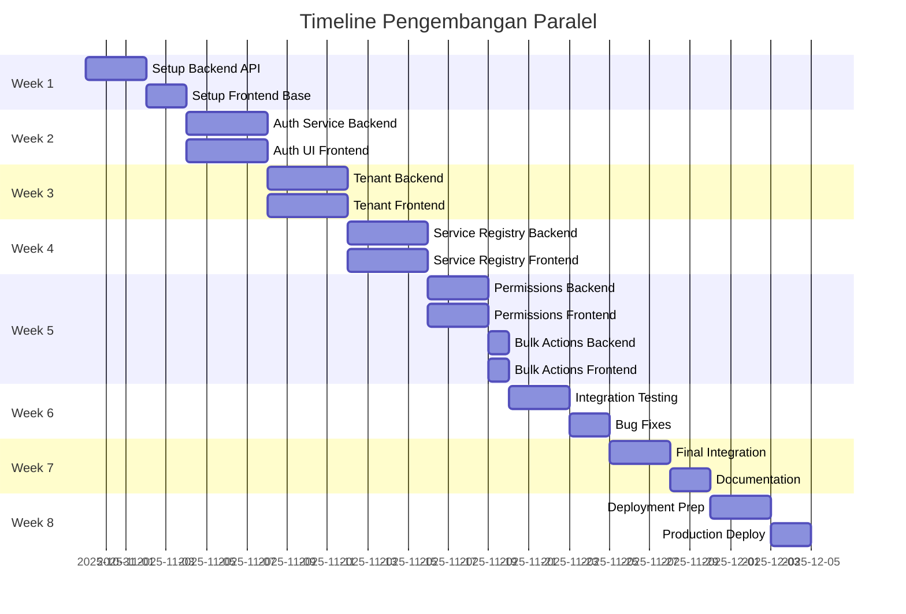
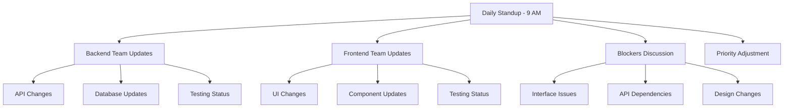

# Parallel Development Plan - Multi-Tenant Service Management Platform

## Overview

Pengembangan paralel frontend dan backend akan meningkatkan efisiensi dan mengurangi waktu development. Dengan pendekatan ini, kedua tim dapat bekerja secara simultan dengan interface yang sudah didefinisikan.

## Development Strategy

### Phase-Based Parallel Development



## Detailed Parallel Tasks

### Week 1: Foundation Setup

#### Backend Tasks (Days 1-3)
- [ ] **B1.1** Project structure setup
  ```bash
  mkdir multi-tenant-platform
  cd multi-tenant-platform
  mkdir backend frontend
  ```

- [ ] **B1.2** Backend dependencies
  ```bash
  cd backend
  npm init -y
  npm install express typescript @types/node @types/express
  npm install prisma @prisma/client bcryptjs jsonwebtoken
  npm install redis bull
  npm install -D nodemon ts-node eslint prettier
  ```

- [ ] **B1.3** Database setup
  - Install MySQL 8.0+
  - Create `platform_core` database
  - Setup Prisma configuration
  - Copy schema dari `docs/architecture/10-complete-database-schema.md`

- [ ] **B1.4** Generate Prisma client
  ```bash
  npx prisma generate
  npx prisma migrate dev --name init
  ```

- [ ] **B1.5** Basic Express server setup
  - Create basic app structure
  - Setup middleware
  - Create health check endpoint

#### Frontend Tasks (Days 3-5)
- [ ] **F1.1** Next.js project setup
  ```bash
  cd ../frontend
  npx create-next-app@latest . --typescript --tailwind --eslint --app
  ```

- [ ] **F1.2** Install frontend dependencies
  ```bash
  npm install zustand @tanstack/react-query react-hook-form
  npm install @hookform/resolvers zod lucide-react
  npm install clsx tailwind-merge @radix-ui/react-*
  ```

- [ ] **F1.3** Setup project structure
  - Create component structure
  - Setup stores directory
  - Setup types directory
  - Setup services directory

- [ ] **F1.4** Configuration setup
  - Update `next.config.js`
  - Setup environment variables
  - Configure Tailwind CSS

- [ ] **F1.5** Base UI components
  - Create basic Button component
  - Create Input component
  - Create Modal component
  - Create Layout components

### Week 2: Authentication System

#### Backend Tasks (Days 6-9)
- [ ] **B2.1** Auth service implementation
  - User service (`src/services/auth/user.service.ts`)
  - Auth service (`src/services/auth/auth.service.ts`)
  - JWT token management
  - Password hashing

- [ ] **B2.2** Authentication endpoints
  - `/auth/login` endpoint
  - `/auth/register` endpoint
  - `/auth/refresh` endpoint
  - `/auth/logout` endpoint

- [ ] **B2.3** Middleware implementation
  - Auth middleware (`src/middleware/auth.middleware.ts`)
  - Request validation
  - Error handling

- [ ] **B2.4** API documentation
  - OpenAPI spec for auth endpoints
  - Postman collection
  - API testing

#### Frontend Tasks (Days 6-9)
- [ ] **F2.1** Auth store implementation
  - Zustand store for auth state
  - Token management
  - User context management

- [ ] **F2.2** Authentication UI components
  - Login form component
  - Register form component
  - Form validation with Zod
  - Error handling

- [ ] **F2.3** Auth layout
  - Auth route layout
  - Route protection middleware
  - Loading states

- [ ] **F2.4** API client setup
  - Axios configuration
  - Request interceptors
  - Error handling
  - Token refresh logic

### Week 3: Tenant Management

#### Backend Tasks (Days 10-13)
- [ ] **B3.1** Tenant service implementation
  - Tenant creation logic
  - Database provisioning
  - Tenant validation

- [ ] **B3.2** User-tenant relationship
  - User-tenant assignment
  - Role assignment
  - Tenant switching logic

- [ ] **B3.3** Tenant endpoints
  - CRUD operations for tenants
  - User management endpoints
  - Bulk operations for tenants

- [ ] **B3.4** Database management
  - Tenant database creation
  - Schema initialization
  - Connection management

#### Frontend Tasks (Days 10-13)
- [ ] **F3.1** Tenant store implementation
  - Zustand store for tenant state
  - Tenant switching logic
  - Tenant data management

- [ ] **F3.2** Tenant management UI
  - Tenant list component
  - Tenant creation form
  - Tenant details view
  - Bulk actions for tenants

- [ ] **F3.3** User management UI
  - User list component
  - User assignment forms
  - Role assignment interface
  - User search and filtering

- [ ] **F3.4** Layout components
  - Header with tenant switcher
  - Sidebar navigation
  - Breadcrumb navigation

### Week 4: Service Registry

#### Backend Tasks (Days 14-17)
- [ ] **B4.1** Service registry implementation
  - Service registration logic
  - Service validation
  - Health monitoring

- [ ] **B4.2** Service endpoints
  - Service CRUD operations
  - Endpoint management
  - Permission mapping

- [ ] **B4.3** Form builder foundation
  - Schema validation
  - Form generation logic
  - Validation rules

- [ ] **B4.4** Menu system
  - Menu generation logic
  - Permission-based filtering
  - Menu caching

#### Frontend Tasks (Days 14-17)
- [ ] **F4.1** Service management UI
  - Service list component
  - Service registration form
  - Service details view
  - Service health monitoring

- [ ] **F4.2** Dynamic form components
  - Dynamic form renderer
  - Field type components
  - Form validation
  - Form submission handling

- [ ] **F4.3** Menu components
  - Dynamic menu generation
  - Menu filtering
  - Navigation components

- [ ] **F4.4** Dashboard components
  - Dashboard layout
  - Service cards
  - Statistics widgets

### Week 5: Permissions & Bulk Actions

#### Backend Tasks (Days 18-21)
- [ ] **B5.1** Permission system
  - Permission service implementation
  - Role management
  - Custom permissions

- [ ] **B5.2** Authorization middleware
  - Permission checking logic
  - Resource-based access control
  - Multi-tenant isolation

- [ ] **B5.3** Bulk actions framework
  - Bulk action service
  - Queue setup (Redis/Bull)
  - Background processing

- [ ] **B5.4** Data lifecycle
  - Soft delete implementation
  - Archive service
  - Restore functionality

#### Frontend Tasks (Days 18-21)
- [ ] **F5.1** Permission management UI
  - Role management interface
  - Permission assignment
  - Role hierarchy visualization

- [ ] **F5.2** Bulk actions UI
  - Bulk action panel
  - Progress tracking
  - Result display
  - Confirmation dialogs

- [ ] **F5.3** Data lifecycle UI
  - Archive/restore interface
  - Soft delete UI
  - Data management tools

- [ ] **F5.4** Admin tools
  - System monitoring dashboard
  - User activity tracking
  - System configuration

### Week 6: Integration & Testing

#### Backend Tasks (Days 22-24)
- [ ] **B6.1** API integration testing
  - Write integration tests
  - Test all endpoints
  - Test error scenarios

- [ ] **B6.2** Performance optimization
  - Database query optimization
  - Response caching
  - Rate limiting

- [ ] **B6.3** Security hardening
  - Input validation
  - SQL injection prevention
  - Rate limiting

#### Frontend Tasks (Days 22-24)
- [ ] **F6.1** Component testing
  - Unit tests for components
  - Integration tests
  - E2E test scenarios

- [ ] **F6.2** Performance optimization
  - Code splitting
  - Lazy loading
  - Bundle optimization

- [ ] **F6.3** UX improvements
  - Loading states
  - Error boundaries
  - Accessibility improvements

### Week 7: Final Integration

#### Backend Tasks (Days 25-27)
- [ ] **B7.1** API documentation
  - Complete OpenAPI spec
  - Interactive documentation
  - Usage examples

- [ ] **B7.2** Monitoring setup
  - Health check endpoints
  - Metrics collection
  - Error tracking

- [ ] **B7.3** Security audit
  - Security testing
  - Vulnerability scanning
  - Penetration testing

#### Frontend Tasks (Days 25-27)
- [ ] **F7.1** Documentation
  - Component documentation
  - Usage guides
  - Storybook setup

- [ ] **F7.2** Deployment preparation
  - Build optimization
  - Environment configuration
  - CI/CD setup

- [ ] **F7.3** Final testing
  - Cross-browser testing
  - Mobile responsiveness
  - Performance testing

### Week 8: Deployment

#### Backend Tasks (Days 28-30)
- [ ] **B8.1** Production setup
  - Docker configuration
  - Environment setup
  - Database migration

- [ ] **B8.2** Monitoring & logging
  - Log aggregation
  - Monitoring setup
  - Alerting configuration

#### Frontend Tasks (Days 28-30)
- [ ] **F8.1** Production deployment
  - Build optimization
  - Static asset serving
  - CDN configuration

- [ ] **F8.2** Performance monitoring
  - Real user monitoring
  - Error tracking
  - Performance metrics

## Communication & Coordination

### Daily Standup Structure


### Interface Definition

#### API Contract Format
```typescript
// Contract definition for authentication
interface AuthContract {
  // Endpoints
  endpoints: {
    login: {
      method: 'POST';
      path: '/api/v1/auth/login';
      request: LoginRequest;
      response: LoginResponse;
    };
    register: {
      method: 'POST';
      path: '/api/v1/auth/register';
      request: RegisterRequest;
      response: RegisterResponse;
    };
  };
}

// Type definitions shared between frontend and backend
interface LoginRequest {
  email: string;
  password: string;
  tenantSlug?: string;
}

interface LoginResponse {
  success: boolean;
  data: {
    user: User;
    tenants: Tenant[];
    tokens: {
      accessToken: string;
      refreshToken: string;
    };
  };
}
```

### Coordination Strategy

#### 1. **Interface-First Development**
- Backend defines API contracts first
- Frontend builds against contracts
- Both teams agree on interface changes

#### 2. **Mock Data Strategy**
- Backend provides mock responses
- Frontend creates mock API layer
- Parallel development without blocking

#### 3. **Regular Sync Points**
- Daily standups for coordination
- Weekly integration meetings
- Bi-weekly retrospective

#### 4. **Version Control Strategy**
- Feature branches for major changes
- Regular merges to develop
- Tagged releases for milestones

## Tools & Collaboration

### Development Tools
```bash
# Shared Tools
- Git for version control
- Slack for communication
- Jira for task management
- Confluence for documentation

# Backend Tools
- MySQL Workbench
- Redis Desktop Manager
- Postman for API testing
- Docker for containerization

# Frontend Tools
- Chrome DevTools
- Storybook for component development
- BrowserStack for testing
- Lighthouse for performance
```

### Communication Channels
1. **Daily Standup** - 9 AM (15 minutes)
2. **Weekly Planning** - Monday 10 AM (1 hour)
3. **Retro/Metrics** - Friday 3 PM (30 minutes)
4. **Emergency Channel** - Slack #development-alerts

## Risk Mitigation

### Potential Blockers & Solutions

#### 1. **API Contract Changes**
- **Risk**: Frontend blocked by backend API changes
- **Solution**: Versioned API contracts, backward compatibility

#### 2. **Database Schema Changes**
- **Risk**: Frontend blocked by database changes
- **Solution:** Database versioning, migration scripts

#### 3. **Design Changes**
- **Risk:** UI/UX changes affecting both teams
- **Solution:** Design freeze after Week 4

#### 4. **Integration Issues**
- **Risk:** Integration problems discovered late
- **Solution:** Regular integration testing, shared test environment

### Quality Assurance Strategy

#### 1. **Continuous Integration**
- Automated builds for both frontend and backend
- Automated testing on every commit
- Code quality checks

#### 2. **Shared Testing Environment**
- Staging environment for integration testing
- Database seeding for consistent test data
- API mocking for frontend development

#### 3. **Definition of Done**
- Backend: API working, documented, tested
- Frontend: UI working, responsive, tested
- Integration: End-to-end flow working

## Success Metrics

### Development Metrics
- **Velocity**: Story points per week
- **Quality**: Bug count, test coverage
- **Communication**: Blocker resolution time

### Technical Metrics
- **API Performance**: Response time < 200ms
- **Frontend Performance**: Lighthouse score > 90
- **Uptime**: 99.9% availability

### Timeline Metrics
- **MVP Delivery**: Week 6
- **Production Ready**: Week 8
- **Feature Complete**: Week 7

---

## Quick Start Commands

### Backend Development Server
```bash
cd backend
npm run dev
# Server runs on http://localhost:3000
```

### Frontend Development Server
```bash
cd frontend
npm run dev
# App runs on http://localhost:3001
```

### Database Operations
```bash
cd backend
npx prisma studio          # Database browser
npx prisma migrate dev      # Run migrations
npx prisma generate        # Regenerate client
```

### Testing Commands
```bash
# Backend
cd backend
npm run test              # Unit tests
npm run test:integration   # Integration tests

# Frontend
cd frontend
npm run test              # Unit tests
npm run test:e2e         # E2E tests
npm run test:coverage     # Coverage report
```

---

## Summary

Pengembangan paralel frontend dan backend dengan pendekatan yang terstruktur dapat:
- **Mengurangi waktu development** hingga 30-40%
- **Meningkatkan kualitas** melalui testing paralel
- **Mempercepat feedback loop** antar tim
- **Mengurangi resiko integrasi** dengan interface terdefinisi
- **Memungkinkan fleksibilitas** dalam perubahan requirements

Dengan timeline 8 minggu, tim dapat menghasilkan MVP yang production-ready dengan fitur-fitur lengkap untuk platform multi-tenant service management.