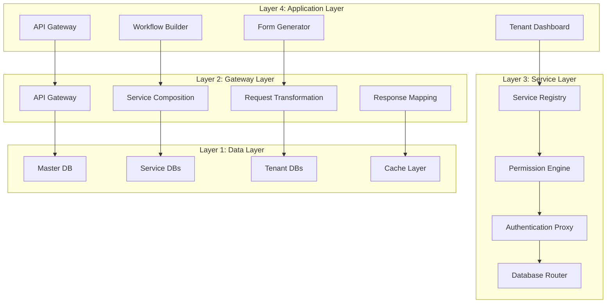

# Service Hub 2.0 Architecture Documentation

## 🎯 Vision Statement

Service Hub 2.0 adalah **Integration Platform as a Service (iPaaS)** yang memungkinkan organisasi untuk:
- **Register multiple services** (internal & external)
- **Build custom workflows** tanpa coding
- **Deliver unified APIs** untuk complex integrations
- **Choose delivery modes** (API-only vs Dashboard)

## 🏗️ Enhanced Architecture Overview

### **Core Architecture Layers**



## 📋 Enhanced Data Models

### **1. User Permission System Integration**

```typescript
// Enhanced Permission Architecture
interface PermissionSystem {
  // Global Permissions (Platform Level)
  globalPermissions: {
    'platform:admin': "Full platform administration",
    'service:create': "Create new services",
    'tenant:create': "Create new tenants",
    'billing:manage': "Manage billing & subscriptions"
  }

  // Service Permissions (Per Service)
  servicePermissions: {
    'service:{serviceId}:read': "Read service data",
    'service:{serviceId}:write': "Write service data",
    'service:{serviceId}:admin': "Administer service",
    'service:{serviceId}:integrate': "Integrate with other services"
  }

  // Module Permissions (Per Service Module)
  modulePermissions: {
    'module:{moduleId}:read': "Read module data",
    'module:{moduleId}:write': "Write module data",
    'module:{moduleId}:delete': "Delete module data",
    'module:{moduleId}:export': "Export module data"
  }

  // Tenant Permissions (Per Tenant)
  tenantPermissions: {
    'tenant:{tenantId}:admin': "Full tenant administration",
    'tenant:{tenantId}:user_manage': "Manage tenant users",
    'tenant:{tenantId}:service_assign': "Assign services to tenant",
    'tenant:{tenantId}:billing_manage': "Manage tenant billing"
  }

  // Cross-Service Permissions
  crossServicePermissions: {
    'integration:create': "Create service integrations",
    'workflow:design': "Design workflows",
    'api:consume': "Consume other service APIs",
    'data:share': "Share data between services"
  }
}
```

### **2. Enhanced Service Registry with Permissions**

```typescript
interface ServiceDefinition {
  id: string
  name: string
  description: string
  type: 'INTERNAL' | 'EXTERNAL' | 'COMPOSITE'

  // Permission Configuration
  requiredPermissions: {
    global: string[]           // Global permissions needed
    service: string[]          // Service-specific permissions
    module: string[]           // Module-level permissions
    tenant: string[]           // Tenant-level permissions
  }

  // Service Modules
  modules: ServiceModule[]

  // API Configuration
  apiConfig: {
    baseUrl: string
    authentication: AuthConfig
    endpoints: APIEndpoint[]
    rateLimiting?: RateLimitConfig
  }

  // Database Configuration
  databaseConfig: {
    type: 'SHARED' | 'DEDICATED' | 'HYBRID'
    isolation: 'TENANT_ISOLATED' | 'SHARED_POOL'
    encryption: boolean
    backup: BackupConfig
  }

  // UI Configuration
  uiConfig: {
    icon: string
    theme: ThemeConfig
    branding: BrandingConfig
    customComponents?: ComponentConfig[]
  }
}

interface ServiceModule {
  id: string
  name: string
  description: string

  // Permission Requirements
  requiredPermissions: {
    read: string[]
    write: string[]
    admin: string[]
  }

  // API Configuration
  apiConfig: {
    endpoint: string
    method: 'GET' | 'POST' | 'PUT' | 'DELETE'
    headers?: Record<string, string>
    authentication: AuthConfig
  }

  // Form Configuration
  formConfig: {
    inputSchema: FormSchema
    validation: ValidationRules
    submitAction: SubmitAction
  }

  // Output Configuration
  outputConfig: {
    schema: OutputSchema
    transformations?: TransformRule[]
    notifications?: NotificationConfig[]
  }

  // Menu Configuration
  menuConfig: {
    displayName: string
    icon: string
    path: string
    order: number
    parent?: string
    subItems?: string[]
  }
}
```

### **3. Enhanced Tenant Configuration**

```typescript
interface EnhancedTenant {
  // Basic Information
  id: string
  name: string
  slug: string
  domain: string

  // Service Configuration
  serviceConfig: {
    assignedServices: TenantService[]
    customEndpoints: CustomEndpoint[]
    integrations: ServiceIntegration[]
    workflows: WorkflowDefinition[]
  }

  // Permission Configuration
  permissionConfig: {
    globalPermissions: string[]
    servicePermissions: Record<string, string[]>
    modulePermissions: Record<string, string[]>
    customRoles: CustomRole[]
    permissionInheritance: InheritanceRule[]
  }

  // Database Configuration
  databaseConfig: {
    assignedDatabases: string[]
    sharedTables: string[]
    isolationRules: IsolationRule[]
    encryptionKeys: EncryptionConfig[]
  }

  // UI Configuration
  uiConfig: {
    theme: ThemeConfig
    branding: BrandingConfig
    customMenus: CustomMenu[]
    dashboardLayout: LayoutConfig
  }

  // Subscription Configuration
  subscriptionConfig: {
    plan: SubscriptionPlan
    limits: ResourceLimits
    features: string[]
    billing: BillingConfig
  }
}
```

## 🔐 Enhanced Permission Engine

### **1. Permission Hierarchy**

```typescript
interface PermissionHierarchy {
  levels: {
    // Level 1: Global Platform Permissions
    global: PermissionLevel

    // Level 2: Service Permissions
    service: PermissionLevel

    // Level 3: Module Permissions
    module: PermissionLevel

    // Level 4: Tenant Permissions
    tenant: PermissionLevel

    // Level 5: Data Permissions
    data: PermissionLevel
  }

  inheritance: {
    parent: string
    child: string
    rules: InheritanceRule[]
  }
}

interface PermissionLevel {
  id: string
  name: string
  description: string
  permissions: Permission[]
  children: string[]
  requiredRoles: string[]
}

interface Permission {
  id: string
  name: string
  action: PermissionAction
  resource: PermissionResource
  scope: PermissionScope
  conditions?: PermissionCondition[]
}
```

### **2. Dynamic Permission Engine**

```typescript
class PermissionEngine {
  // Check if user has specific permission
  async hasPermission(
    userId: string,
    permission: string,
    context: PermissionContext
  ): Promise<boolean> {
    // 1. Get user roles
    const userRoles = await this.getUserRoles(userId, context.tenantId)

    // 2. Get permissions from roles
    const permissions = await this.getPermissionsFromRoles(userRoles)

    // 3. Check permission existence
    const hasPermission = permissions.includes(permission)

    // 4. Check conditions if any
    if (hasPermission && context.conditions) {
      return await this.checkPermissionConditions(permission, context)
    }

    return hasPermission
  }

  // Get user permissions with context
  async getUserPermissions(
    userId: string,
    context: PermissionContext
  ): Promise<Permission[]> {
    const userRoles = await this.getUserRoles(userId, context.tenantId)
    const permissions = new Set<Permission>()

    // Add permissions from roles
    for (const role of userRoles) {
      const rolePermissions = await this.getRolePermissions(role, context)
      rolePermissions.forEach(p => permissions.add(p))
    }

    // Add inherited permissions
    const inheritedPermissions = await this.getInheritedPermissions(permissions, context)
    inheritedPermissions.forEach(p => permissions.add(p))

    return Array.from(permissions)
  }

  // Filter data based on permissions
  async filterData<T>(
    data: T[],
    userId: string,
    requiredPermission: string,
    context: PermissionContext
  ): Promise<T[]> {
    const hasAccess = await this.hasPermission(userId, requiredPermission, context)

    if (!hasAccess) {
      return []
    }

    // Apply row-level security if needed
    return data.filter(item =>
      this.checkRowAccess(item, userId, requiredPermission, context)
    )
  }
}
```

## 📝 Task Breakdown for Implementation

### **Phase 1: Foundation Architecture (Week 1-4)**

#### **Week 1: Database Schema Design**
- [ ] Design master database schema
- [ ] Create service registry tables
- [ ] Design permission system tables
- [ ] Create user role assignment tables
- [ ] Design multi-database routing tables
- [ ] Create database migration scripts

**Files to create:**
```
backend/prisma/schema-enhanced.prisma
backend/migrations/001-service-registry.sql
backend/migrations/002-permission-system.sql
backend/migrations/003-multi-database.sql
```

#### **Week 2: Core Service Models**
- [ ] Implement ServiceDefinition model
- [ ] Implement ServiceModule model
- [ ] Implement EnhancedTenant model
- [ ] Implement Permission models
- [ ] Create service validation schemas
- [ ] Set up database relationships

**Files to create:**
```
backend/src/models/service.ts
backend/src/models/permission.ts
backend/src/models/tenant.ts
backend/src/schemas/service.schema.ts
```

#### **Week 3: Permission Engine**
- [ ] Implement PermissionEngine class
- [ ] Create permission checking logic
- [ ] Implement role-based access control
- [ ] Create permission inheritance system
- [ ] Implement row-level security
- [ ] Add permission caching

**Files to create:**
```
backend/src/services/permission.service.ts
backend/src/services/role.service.ts
backend/src/middleware/permission.middleware.ts
backend/src/utils/permission.utils.ts
```

#### **Week 4: Service Registry Core**
- [ ] Implement ServiceRegistry class
- [ ] Create service registration API
- [ ] Implement service validation
- [ ] Create service listing API
- [ ] Add service search/filtering
- [ ] Implement service versioning

**Files to create:**
```
backend/src/services/service-registry.service.ts
backend/src/controllers/service-registry.controller.ts
backend/src/routes/service-registry.routes.ts
```

### **Phase 2: API Gateway & Integration (Week 5-8)**

#### **Week 5: API Gateway Foundation**
- [ ] Implement APIGateway class
- [ ] Create request routing system
- [ ] Implement authentication proxy
- [ ] Add rate limiting per tenant
- [ ] Create request/response logging
- [ ] Implement error handling

**Files to create:**
```
backend/src/gateway/api-gateway.service.ts
backend/src/gateway/request-router.service.ts
backend/src/gateway/auth-proxy.service.ts
backend/src/gateway/rate-limiter.service.ts
```

#### **Week 6: External Service Integration**
- [ ] Implement external API client
- [ ] Create service authentication handlers
- [ ] Implement request/response transformation
- [ ] Add webhook handling
- [ ] Create service health monitoring
- [ ] Implement retry logic

**Files to create:**
```
backend/src/integrations/external-api.service.ts
backend/src/integrations/webhook.service.ts
backend/src/integrations/service-health.service.ts
```

#### **Week 7: Service Composition**
- [ ] Implement workflow engine
- [ ] Create service composition logic
- [ ] Add conditional routing
- [ ] Implement data mapping between services
- [ ] Create workflow testing tools
- [ ] Add workflow monitoring

**Files to create:**
```
backend/src/workflow/workflow-engine.service.ts
backend/src/workflow/composition.service.ts
backend/src/workflow/data-mapper.service.ts
backend/src/workflow/workflow-monitor.service.ts
```

#### **Week 8: Advanced Gateway Features**
- [ ] Implement API versioning
- [ ] Add request/response caching
- [ ] Create analytics tracking
- [ ] Implement service mocking
- [ ] Add security scanning
- [ ] Create performance monitoring

**Files to create:**
```
backend/src/gateway/api-versioning.service.ts
backend/src/gateway/cache.service.ts
backend/src/analytics/service-analytics.service.ts
```

### **Phase 3: Dynamic UI Generation (Week 9-12)**

#### **Week 9: Form Generation Engine**
- [ ] Implement FormGenerator class
- [ ] Create dynamic form components
- [ ] Add form validation logic
- [ ] Implement conditional form fields
- [ ] Create form submission handling
- [ ] Add form analytics

**Files to create:**
```
backend/src/forms/form-generator.service.ts
backend/src/components/dynamic-form.tsx
web/src/components/dynamic-forms/FormRenderer.tsx
web/src/components/dynamic-forms/FormFields.tsx
```

#### **Week 10: Menu Generation System**
- [ ] Implement MenuGenerator class
- [ ] Create dynamic menu components
- [ ] Add permission-based menu filtering
- [ ] Implement menu hierarchy
- [ ] Create menu customization
- [ ] Add menu analytics

**Files to create:**
```
backend/src/menu/menu-generator.service.ts
backend/src/menu/permission-filter.service.ts
web/src/components/navigation/DynamicMenu.tsx
web/src/components/navigation/MenuRenderer.tsx
```

#### **Week 11: Component Generation**
- [ ] Implement ComponentGenerator class
- [ ] Create dynamic page templates
- [ ] Add component library
- [ ] Implement template system
- [ ] Create component customization
- [ ] Add component testing

**Files to create:**
```
backend/src/components/component-generator.service.ts
backend/src/templates/page-templates.ts
web/src/components/dynamic/ComponentRenderer.tsx
web/src/components/dynamic/TemplateLoader.tsx
```

#### **Week 12: Service Marketplace**
- [ ] Implement marketplace features
- [ ] Create service catalog
- [ ] Add service rating/reviews
- [ ] Implement service installation
- [ ] Create service updates
- [ ] Add billing integration

**Files to create:**
```
backend/src/marketplace/marketplace.service.ts
backend/src/billing/subscription.service.ts
web/src/pages/marketplace/ServiceCatalog.tsx
web/src/pages/marketplace/ServiceDetails.tsx
```

### **Phase 4: Advanced Features (Week 13-16)**

#### **Week 13: Multi-Database Management**
- [ ] Implement DatabaseRouter class
- [ ] Create database provisioning
- [ ] Add database health monitoring
- [ ] Implement database backup/restore
- [ ] Create database analytics
- [ ] Add database scaling

**Files to create:**
```
backend/src/database/database-router.service.ts
backend/src/database/provisioning.service.ts
backend/src/database/backup.service.ts
backend/src/analytics/database-analytics.service.ts
```

#### **Week 14: Advanced Security**
- [ ] Implement API security scanning
- [ ] Create audit logging system
- [ ] Add data encryption
- [ ] Implement intrusion detection
- [ ] Create security reporting
- [ ] Add compliance tracking

**Files to create:**
```
backend/src/security/security-scanner.service.ts
backend/src/audit/audit-log.service.ts
backend/src/security/encryption.service.ts
backend/src/compliance/compliance.service.ts
```

#### **Week 15: Analytics & Monitoring**
- [ ] Implement comprehensive analytics
- [ ] Create real-time monitoring
- [ ] Add custom dashboards
- [ ] Implement alerting system
- [ ] Create performance metrics
- [ ] Add usage analytics

**Files to create:**
```
backend/src/analytics/comprehensive-analytics.service.ts
backend/src/monitoring/real-time.service.ts
backend/src/alerting/alert-system.service.ts
backend/src/metrics/performance.service.ts
```

#### **Week 16: Testing & QA**
- [ ] Implement automated testing
- [ ] Create integration tests
- [ ] Add performance testing
- [ ] Implement security testing
- [ ] Create load testing
- [ ] Add user acceptance testing

**Files to create:**
```
backend/tests/integration/service-registry.test.ts
backend/tests/integration/api-gateway.test.ts
backend/tests/performance/load-test.ts
backend/tests/security/security-test.ts
```

## 🎯 Success Metrics

### **Development Metrics**
- **Code Quality**: 90%+ test coverage
- **Performance**: <200ms API response time
- **Security**: Zero critical vulnerabilities
- **Documentation**: 100% API coverage

### **Business Metrics**
- **Service Registration Time**: <5 minutes
- **User Onboarding Time**: <30 minutes
- **Service Integration Success**: 95%+
- **Customer Satisfaction**: 4.5/5

### **Technical Metrics**
- **System Uptime**: 99.9%
- **Error Rate**: <0.1%
- **Scalability**: 10,000+ concurrent users
- **Data Security**: 100% encryption

## 🚀 Next Steps

1. **Start with Phase 1** - Foundation architecture
2. **Focus on Permission System** - Critical for multi-tenant
3. **Build Service Registry** - Core of the platform
4. **Implement Incrementally** - Test each phase thoroughly
5. **Gather User Feedback** - Iterate based on user needs

---

**Ready to start Phase 1: Foundation Architecture?** 🚀