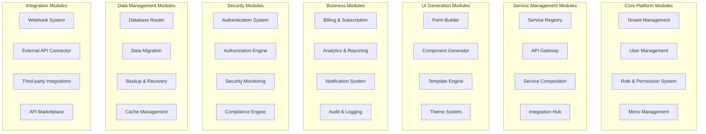
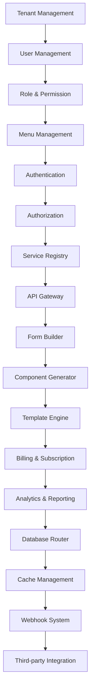

# Service Hub Complete Module Architecture

## 🏗️ Complete Module Ecosystem

Service Hub bukan hanya service registry tapi platform lengkap dengan semua modul pendukung untuk multi-tenant SaaS platform.

## 📋 Module Architecture Overview



## 🎯 Core Platform Modules

### **1. Tenant Management Module**

```typescript
interface TenantManagementModule {
  // Core tenant operations
  features: [
    "Tenant CRUD operations",
    "Tenant provisioning",
    "Resource allocation",
    "Service assignment",
    "Database management",
    "Domain management",
    "SSL management",
    "Tenant health monitoring"
  ]

  // Advanced tenant features
  advancedFeatures: [
    "Multi-domain support",
    "Tenant templates",
    "Bulk operations",
    "Tenant cloning",
    "Tenant archiving",
    "Data isolation controls",
    "Compliance reporting"
  ]

  // Business logic
  businessRules: [
    "Tenant uniqueness validation",
    "Resource limit enforcement",
    "Service availability checks",
    "Billing integration",
    "SLA monitoring"
  ]
}
```

### **2. User Management Module**

```typescript
interface UserManagementModule {
  // User operations
  features: [
    "Multi-tenant user CRUD",
    "User import/export",
    "User activation/deactivation",
    "User profile management",
    "Password management",
    "Session management",
    "User analytics"
  ]

  // Advanced user features
  advancedFeatures: [
    "User templates",
    "Bulk user operations",
    "User lifecycle management",
    "User activity tracking",
    "User segmentation",
    "Custom user fields",
    "User self-service portal"
  ]

  // Integration points
  integrations: [
    "LDAP/Active Directory",
    "OAuth providers (Google, Microsoft, etc)",
    "SSO systems",
    "HR systems",
    "CRM systems"
  ]
}
```

### **3. Role & Permission Module**

```typescript
interface RolePermissionModule {
  // Role management
  roleFeatures: [
    "Role CRUD operations",
    "Role templates",
    "Role inheritance",
    "Role assignment",
    "Custom roles creation",
    "Role analytics",
    "Role lifecycle management"
  ]

  // Permission system
  permissionFeatures: [
    "Hierarchical permissions",
    "Resource-based permissions",
    "Action-based permissions",
    "Conditional permissions",
    "Permission inheritance",
    "Dynamic permissions",
    "Permission analytics"
  ]

  // Advanced features
  advancedFeatures: [
    "Permission templates",
    "Role cloning",
    "Permission testing",
    "Access request workflow",
    "Compliance reporting",
    "Audit trails"
  ]
}
```

### **4. Menu Management Module**

```typescript
interface MenuManagementModule {
  // Menu operations
  features: [
    "Dynamic menu generation",
    "Permission-based menu filtering",
    "Menu hierarchy management",
    "Custom menu creation",
    "Menu templates",
    "Menu analytics",
    "Responsive menu design"
  ]

  // Advanced menu features
  advancedFeatures: [
    "Multi-level menu nesting",
    "Conditional menu items",
    "Dynamic menu routing",
    "Menu personalization",
    "Menu A/B testing",
    "Menu heatmaps",
    "Menu accessibility"
  ]

  // Integration points
  integrations: [
    "Service registry (auto-generate menus)",
    "Permission engine (filtering)",
    "Theme system (styling)",
    "Analytics system (tracking)"
  ]
}
```

## 🔧 Service Management Modules

### **5. Service Registry Module**

```typescript
interface ServiceRegistryModule {
  // Service operations
  features: [
    "Service registration",
    "Service validation",
    "Service versioning",
    "Service categorization",
    "Service documentation",
    "Service analytics",
    "Service marketplace"
  ]

  // Advanced service features
  advancedFeatures: [
    "Service templates",
    "Service cloning",
    "Service composition",
    "Service dependencies",
    "Service health monitoring",
    "Service compliance checking",
    "Service SLA tracking"
  ]

  // API management
  apiFeatures: [
    "API specification management",
    "API versioning",
    "API documentation generation",
    "API testing tools",
    "API analytics",
    "API rate limiting"
  ]
}
```

### **6. API Gateway Module**

```typescript
interface APIGatewayModule {
  // Gateway operations
  features: [
    "Request routing",
    "Service discovery",
    "Load balancing",
    "Rate limiting",
    "Authentication proxy",
    "Request/response transformation",
    "Error handling"
  ]

  // Advanced gateway features
  advancedFeatures: [
    "Multi-protocol support",
    "Service mesh integration",
    "Circuit breaker patterns",
    "Retry mechanisms",
    "Request caching",
    "Response aggregation",
    "API composition"
  ]

  // Security features
  securityFeatures: [
    "API key management",
    "OAuth integration",
    "JWT validation",
    "IP whitelisting",
    "Request signing",
    "Rate limiting per tenant",
    "Security scanning"
  ]
}
```

### **7. Service Composition Module**

```typescript
interface ServiceCompositionModule {
  // Composition features
  features: [
    "Visual workflow builder",
    "Service chaining",
    "Data mapping",
    "Conditional routing",
    "Parallel processing",
    "Error handling",
    "Workflow templates"
  ]

  // Advanced composition features
  advancedFeatures: [
    "AI-powered suggestions",
    "Workflow optimization",
    "Performance monitoring",
    "Cost optimization",
    "Compliance checking",
    "Automated testing",
    "Workflow analytics"
  ]

  // Integration capabilities
  integrations: [
    "External APIs",
    "Internal services",
    "Webhooks",
    "Event streams",
    "Message queues",
    "Database systems"
  ]
}
```

### **8. Integration Hub Module**

```typescript
interface IntegrationHubModule {
  // Integration operations
  features: [
    "Connector management",
    "Integration templates",
    "Data synchronization",
    "Real-time events",
    "Batch processing",
    "Error recovery",
    "Integration analytics"
  ]

  // Connector types
  connectorTypes: [
    "Database connectors",
    "API connectors",
    "File system connectors",
    "Message queue connectors",
    "Cloud service connectors",
    "Legacy system connectors"
  ]

  // Advanced integration features
  advancedFeatures: [
    "Low-code integration builder",
    "Integration testing",
    "Performance monitoring",
    "Data transformation",
    "Schema mapping",
    "Conflict resolution"
  ]
}
```

## 🎨 UI Generation Modules

### **9. Form Builder Module**

```typescript
interface FormBuilderModule {
  // Form operations
  features: [
    "Dynamic form generation",
    "Form field types",
    "Form validation",
    "Form submission",
    "Form templates",
    "Form analytics",
    "Form A/B testing"
  ]

  // Advanced form features
  advancedFeatures: [
    "Conditional form logic",
    "Multi-step forms",
    "Form dependencies",
    "Auto-save functionality",
    "Form progress tracking",
    "Form personalization",
    "Responsive form design"
  ]

  // Form field types
  fieldTypes: [
    "Text inputs (single, multi-line)",
    "Number inputs",
    "Date/time pickers",
    "Select dropdowns",
    "Multi-select",
    "File uploads",
    "Rich text editors",
    "Custom components"
  ]
}
```

### **10. Component Generator Module**

```typescript
interface ComponentGeneratorModule {
  // Generation operations
  features: [
    "Component template library",
    "Dynamic component creation",
    "Component customization",
    "Component testing",
    "Component deployment",
    "Component analytics",
    "Component marketplace"
  ]

  // Component types
  componentTypes: [
    "Data tables",
    "Charts and graphs",
    "Forms and inputs",
    "Cards and panels",
    "Navigation components",
    "Modal dialogs",
    "List components",
    "Custom widgets"
  ]

  // Advanced generation features
  advancedFeatures: [
    "AI-powered suggestions",
    "Component optimization",
    "Accessibility compliance",
    "Performance monitoring",
    "Cross-browser compatibility",
    "Mobile responsiveness"
  ]
}
```

### **11. Template Engine Module**

```typescript
interface TemplateEngineModule {
  // Template operations
  features: [
    "Template creation",
    "Template customization",
    "Template marketplace",
    "Template analytics",
    "Template versioning",
    "Template cloning",
    "Template testing"
  ]

  // Template types
  templateTypes: [
    "Page templates",
    "Dashboard templates",
    "Form templates",
    "Report templates",
    "Email templates",
    "Mobile templates",
    "Custom layouts"
  ]

  // Advanced template features
  advancedFeatures: [
    "Dynamic content injection",
    "Template variables",
    "Conditional rendering",
    "Template inheritance",
    "Template optimization",
    "A/B testing support",
    "Personalization engine"
  ]
}
```

### **12. Theme System Module**

```typescript
interface ThemeSystemModule {
  // Theme operations
  features: [
    "Theme creation",
    "Theme customization",
    "Theme marketplace",
    "Theme analytics",
    "Theme versioning",
    "Theme preview",
    "Theme export/import"
  ]

  // Theme components
  themeComponents: [
    "Color palettes",
    "Typography systems",
    "Component styling",
    "Layout systems",
    "Icon libraries",
    "Brand guidelines",
    "Accessibility features"
  ]

  // Advanced theme features
  advancedFeatures: [
    "Dark/light mode support",
    "Brand customization",
    "Dynamic theming",
    "Theme inheritance",
    "CSS variable management",
    "Performance optimization",
    "Accessibility compliance"
  ]
}
```

## 💼 Business Modules

### **13. Billing & Subscription Module**

```typescript
interface BillingSubscriptionModule {
  // Billing operations
  features: [
    "Subscription management",
    "Plan configuration",
    "Pricing management",
    "Invoice generation",
    "Payment processing",
    "Billing analytics",
    "Revenue reporting"
  ]

  // Billing features
  billingFeatures: [
    "Multiple pricing models",
    "Usage-based billing",
    "Tiered subscriptions",
    "Trial periods",
    "Discount management",
    "Billing cycles",
    "Auto-renewal management"
  ]

  // Payment integrations
  paymentIntegrations: [
    "Stripe",
    "PayPal",
    "Square",
    "Adyen",
    "Bank transfers",
    "Cryptocurrency",
    "Custom payment gateways"
  ]
}
```

### **14. Analytics & Reporting Module**

```typescript
interface AnalyticsReportingModule {
  // Analytics operations
  features: [
    "User analytics",
    "Service analytics",
    "Financial analytics",
    "Performance analytics",
    "Custom reports",
    "Dashboard creation",
    "Data visualization"
  ]

  // Analytics features
  analyticsFeatures: [
    "Real-time dashboards",
    "Custom metrics",
    "Data exploration",
    "Trend analysis",
    "Predictive analytics",
    "Cohort analysis",
    "Funnel analysis"
  ]

  // Report types
  reportTypes: [
    "Executive reports",
    "Technical reports",
    "Financial reports",
    "Compliance reports",
    "Custom reports",
    "Scheduled reports",
    "Ad-hoc reports"
  ]
}
```

### **15. Notification System Module**

```typescript
interface NotificationSystemModule {
  // Notification operations
  features: [
    "Multi-channel notifications",
    "Notification templates",
    "User preferences",
    "Notification scheduling",
    "Delivery tracking",
    "Notification analytics",
    "Compliance management"
  ]

  // Notification channels
  channels: [
    "Email notifications",
    "SMS notifications",
    "Push notifications",
    "In-app notifications",
    "Webhook notifications",
    "Slack/Discord integration",
    "WhatsApp integration"
  ]

  // Advanced notification features
  advancedFeatures: [
    "Personalized content",
    "Trigger-based automation",
    "Multi-language support",
    "Delivery optimization",
    "Failed delivery handling",
    "Notification batching",
    "Analytics integration"
  ]
}
```

### **16. Audit & Logging Module**

```typescript
interface AuditLoggingModule {
  // Audit operations
  features: [
    "Activity logging",
    "Audit trail creation",
    "Log management",
    "Log analytics",
    "Compliance reporting",
    "Security monitoring",
    "Data retention policies"
  ]

  // Log types
  logTypes: [
    "User activity logs",
    "System event logs",
    "Security event logs",
    "Business transaction logs",
    "Error logs",
    "Performance logs",
    "API access logs"
  ]

  // Advanced logging features
  advancedFeatures: [
    "Real-time log streaming",
    "Log search and filtering",
    "Log aggregation",
    "Log visualization",
    "Alert configuration",
    "Log archiving",
    "Compliance automation"
  ]
}
```

## 🔐 Security Modules

### **17. Authentication System Module**

```typescript
interface AuthenticationSystemModule {
  // Authentication operations
  features: [
    "Multi-factor authentication",
    "Social login integration",
    "SSO management",
    "Session management",
    "Password policies",
    "Account recovery",
    "Security monitoring"
  ]

  // Authentication methods
  methods: [
    "Username/password",
    "Email/password",
    "Phone/SMS verification",
    "Social providers (Google, Microsoft, etc)",
    "SAML 2.0",
    "OpenID Connect",
    "JWT tokens",
    "API keys"
  ]

  // Advanced authentication features
  advancedFeatures: [
    "Adaptive authentication",
    "Risk-based authentication",
    "Biometric authentication",
    "Device trust management",
    "Location-based authentication",
    "Time-based authentication",
    "Compliance enforcement"
  ]
}
```

### **18. Authorization Engine Module**

```typescript
interface AuthorizationEngineModule {
  // Authorization operations
  features: [
    "Permission evaluation",
    "Role-based access control",
    "Attribute-based access control",
    "Policy management",
    "Access request workflow",
    "Authorization caching",
    "Compliance enforcement"
  ]

  // Authorization models
  models: [
    "RBAC (Role-Based Access Control)",
    "ABAC (Attribute-Based Access Control)",
    "PBAC (Policy-Based Access Control)",
    "Hybrid models",
    "Custom authorization logic"
  ]

  // Advanced authorization features
  advancedFeatures: [
    "Dynamic permission evaluation",
    "Context-aware authorization",
    "Delegated authorization",
    "Temporary access grants",
    "Emergency access procedures",
    "Compliance automation",
    "Audit trail integration"
  ]
}
```

### **19. Security Monitoring Module**

```typescript
interface SecurityMonitoringModule {
  // Security operations
  features: [
    "Threat detection",
    "Vulnerability scanning",
    "Security incident response",
    "Risk assessment",
    "Compliance monitoring",
    "Security analytics",
    "Alert management"
  ]

  // Security monitoring
  monitoringAreas: [
    "Authentication security",
    "Authorization security",
    "Data security",
    "Network security",
    "Application security",
    "Infrastructure security",
    "User behavior analytics"
  ]

  // Advanced security features
  advancedFeatures: [
    "AI-powered threat detection",
    "Real-time security monitoring",
    "Automated incident response",
    "Security orchestration",
    "Compliance automation",
    "Forensic capabilities",
    "Security intelligence"
  ]
}
```

### **20. Compliance Engine Module**

```typescript
interface ComplianceEngineModule {
  // Compliance operations
  features: [
    "Compliance framework management",
    "Policy enforcement",
    "Compliance monitoring",
    "Audit trail creation",
    "Compliance reporting",
    "Risk assessment",
    "Remediation management"
  ]

  // Compliance frameworks
  frameworks: [
    "GDPR (General Data Protection)",
    "SOC 2 (Service Organization Control)",
    "ISO 27001 (Information Security)",
    "HIPAA (Healthcare)",
    "PCI DSS (Payment Card)",
    "SOX (Sarbanes-Oxley)",
    "Custom frameworks"
  ]

  // Advanced compliance features
  advancedFeatures: [
    "Automated compliance checking",
    "Policy violation detection",
    "Risk scoring",
    "Remediation recommendations",
    "Compliance dashboards",
    "Audit automation",
    "Evidence collection"
  ]
}
```

## 💾 Data Management Modules

### **21. Database Router Module**

```typescript
interface DatabaseRouterModule {
  // Routing operations
  features: [
    "Multi-database routing",
    "Tenant database assignment",
    "Read/write splitting",
    "Load balancing",
    "Failover management",
    "Connection pooling",
    "Database health monitoring"
  ]

  // Database types
  databaseTypes: [
    "PostgreSQL",
    "MySQL",
    "MongoDB",
    "Redis",
    "Elasticsearch",
    "Custom databases",
    "Cloud databases"
  ]

  // Advanced routing features
  advancedFeatures: [
    "Dynamic database provisioning",
    "Database scaling",
    "Migration management",
    "Backup coordination",
    "Performance optimization",
    "Cost optimization",
    "Multi-region support"
  ]
}
```

### **22. Data Migration Module**

```typescript
interface DataMigrationModule {
  // Migration operations
  features: [
    "Schema migration",
    "Data transformation",
    "Bulk data transfer",
    "Incremental migration",
    "Rollback capabilities",
    "Migration scheduling",
    "Data validation"
  ]

  // Migration types
  migrationTypes: [
    "Database migrations",
    "Schema changes",
    "Data format changes",
    "Platform migrations",
    "Cloud migrations",
    "Vendor migrations",
    "Custom transformations"
  ]

  // Advanced migration features
  advancedFeatures: [
    "Zero-downtime migrations",
    "Live data synchronization",
    "Conflict resolution",
    "Performance optimization",
    "Data integrity checks",
    "Migration analytics",
    "Compliance tracking"
  ]
}
```

### **23. Backup & Recovery Module**

```typescript
interface BackupRecoveryModule {
  // Backup operations
  features: [
    "Automated backup scheduling",
    "Incremental backups",
    "Full database backups",
    "File system backups",
    "Cloud backup integration",
    "Backup verification",
    "Recovery testing"
  ]

  // Backup types
  backupTypes: [
    "Database backups",
    "Application backups",
    "File system backups",
    "Configuration backups",
    "Cloud storage backups",
    "Disaster recovery backups",
    "Compliance backups"
  ]

  // Advanced backup features
  advancedFeatures: [
    "Point-in-time recovery",
    "Cross-region replication",
    "Backup encryption",
    "Compression optimization",
    "Retention policy management",
    "Recovery time objectives",
    "Recovery point objectives"
  ]
}
```

### **24. Cache Management Module**

```typescript
interface CacheManagementModule {
  // Cache operations
  features: [
    "Multi-level caching",
    "Cache invalidation",
    "Cache warming",
    "Cache analytics",
    "Performance optimization",
    "Memory management",
    "Cache synchronization"
  ]

  // Cache types
  cacheTypes: [
    "Memory cache (Redis)",
    "Database query cache",
    "API response cache",
    "Application cache",
    "CDN cache",
    "Object storage cache",
    "Custom cache layers"
  ]

  // Advanced cache features
  advancedFeatures: [
    "Intelligent cache warming",
    "Predictive caching",
    "Cache compression",
    "Distributed caching",
    "Cache invalidation strategies",
    "Cache analytics",
    "Performance monitoring"
  ]
}
```

## 🔗 Integration Modules

### **25. Webhook System Module**

```typescript
interface WebhookSystemModule {
  // Webhook operations
  features: [
    "Webhook endpoint creation",
    "Webhook event management",
    "Webhook delivery",
    "Retry mechanisms",
    "Webhook analytics",
    "Webhook security",
    "Webhook templates"
  ]

  // Webhook features
  webhookFeatures: [
    "Event filtering",
    "Payload transformation",
    "Signature verification",
    "Rate limiting",
    "Delivery confirmation",
    "Failed delivery handling",
    "Webhook testing"
  ]

  // Advanced webhook features
  advancedFeatures: [
    "Batch webhook delivery",
    "Webhook orchestration",
    "Conditional webhooks",
    "Webhook chaining",
    "Webhook analytics",
    "Security monitoring",
    "Compliance tracking"
  ]
}
```

### **26. External API Connector Module**

```typescript
interface ExternalAPIConnectorModule {
  // Connector operations
  features: [
    "API connector creation",
    "Authentication management",
    "Data synchronization",
    "Error handling",
    "Rate limiting",
    "Performance optimization",
    "Connector analytics"
  ]

  // API types
  apiTypes: [
    "REST APIs",
    "GraphQL APIs",
    "SOAP APIs",
    "gRPC APIs",
    "WebSocket APIs",
    "Event streaming APIs",
    "File transfer APIs"
  ]

  // Advanced connector features
  advancedFeatures: [
    "Auto-discovery",
    "API specification import",
    "Dynamic connector generation",
    "Performance optimization",
    "Error recovery",
    "Data transformation",
    "Integration testing"
  ]
}
```

### **27. Third-party Integration Module**

```typescript
interface ThirdPartyIntegrationModule {
  // Integration operations
  features: [
    "Integration marketplace",
    "Connector library",
    "Integration templates",
    "Configuration management",
    "Data synchronization",
    "Error handling",
    "Integration analytics"
  ]

  // Integration categories
  categories: [
    "CRM systems",
    "Email marketing",
    "Project management",
    "Communication tools",
    "Analytics platforms",
    "E-commerce platforms",
    "Payment processors"
  ]

  // Popular integrations
  popularIntegrations: [
    "Salesforce",
    "HubSpot",
    "Mailchimp",
    "SendGrid",
    "Twilio",
    "Stripe",
    "Shopify",
    "Google Workspace",
    "Microsoft 365"
  ]
}
```

### **28. API Marketplace Module**

```typescript
interface APIMarketplaceModule {
  // Marketplace operations
  features: [
    "Service listing",
    "Service discovery",
    "Service testing",
    "Service installation",
    "Service management",
    "Service reviews",
    "Service analytics"
  ]

  // Marketplace features
  marketplaceFeatures: [
    "Service categories",
    "Service search",
    "Service filtering",
    "Service comparison",
    "Service reviews",
    "Service documentation",
    "Service support"
  ]

  // Advanced marketplace features
  advancedFeatures: [
    "Service recommendations",
    "Usage analytics",
    "Revenue sharing",
    "Service bundling",
    "Service white-labeling",
    "Marketplace analytics",
    "Developer ecosystem"
  ]
}
```

## 🚀 Implementation Strategy

### **Phase 1: Core Foundation (Weeks 1-8)**
- Week 1-2: Tenant + User + Role/Permission modules
- Week 3-4: Menu + Authentication modules
- Week 5-6: Authorization + Security Monitoring modules
- Week 7-8: Compliance + Audit modules

### **Phase 2: Service Layer (Weeks 9-16)**
- Week 9-10: Service Registry + API Gateway modules
- Week 11-12: Service Composition + Integration Hub modules
- Week 13-14: External API + Third-party modules
- Week 15-16: API Marketplace + advanced features

### **Phase 3: UI Generation (Weeks 17-24)**
- Week 17-18: Form Builder + Component Generator modules
- Week 19-20: Template Engine + Theme System modules
- Week 21-22: Custom UI creation tools
- Week 23-24: Advanced UI features + testing

### **Phase 4: Business & Data (Weeks 25-32)**
- Week 25-26: Billing + Subscription modules
- Week 27-28: Analytics + Reporting modules
- Week 29-30: Notification + Logging modules
- Week 31-32: Database + Cache + Backup modules

## 📊 Module Dependencies



## 🎯 Module Success Metrics

### **Development Metrics**
- **Module Test Coverage**: 90%+
- **Module Integration Success**: 95%+
- **Module Performance**: <200ms response time
- **Module Documentation**: 100% coverage

### **Business Metrics**
- **Module Adoption Rate**: 80%+
- **Module Integration Time**: <15 minutes
- **Module Satisfaction**: 4.5/5
- **Module Revenue Impact**: 25%+ increase

### **Technical Metrics**
- **Module Uptime**: 99.9%
- **Module Error Rate**: <0.1%
- **Module Scalability**: 10,000+ users
- **Module Security**: Zero critical vulnerabilities

---

**Service Hub is a complete platform with 28 integrated modules, not just a service registry!** 🚀

Each module is designed to work seamlessly with others, creating a powerful multi-tenant SaaS platform that can handle any business requirement.