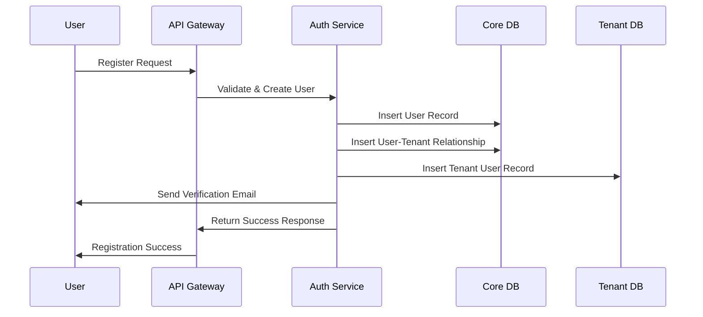
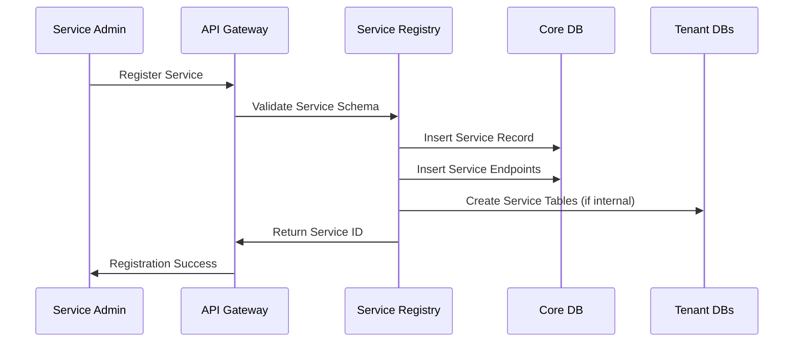
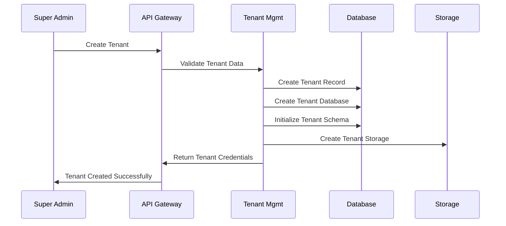

# Database Schema Design - Multi-Tenant Service Management Platform

## Database Architecture Overview

Platform ini menggunakan **Hybrid Multi-Tenant Database Strategy** dengan kombinasi shared database untuk core metadata dan isolated databases untuk tenant-specific data.

## Database Strategy

### 1. **Shared Core Database** (`platform_core`)
- Centralized system data
- User management across all tenants
- Service registry dan metadata
- System configuration

### 2. **Tenant-Specific Databases** (`tenant_{tenant_id}`)
- Isolated data per tenant
- Custom schemas based on assigned services
- Independent backups dan restores
- Performance isolation

### 3. **Read Replicas**
- Core database replicas for reporting
- Tenant database replicas for analytics
- Reduced load on primary databases

## Core Database Schema (`platform_core`)

### 1. Users Table
```sql
CREATE TABLE users (
    id VARCHAR(36) PRIMARY KEY DEFAULT (UUID()),
    email VARCHAR(255) UNIQUE NOT NULL,
    password_hash VARCHAR(255) NOT NULL,
    name VARCHAR(255) NOT NULL,

    -- Status & Verification
    status ENUM('ACTIVE', 'INACTIVE', 'SUSPENDED') DEFAULT 'ACTIVE',
    email_verified BOOLEAN DEFAULT FALSE,
    phone_verified BOOLEAN DEFAULT FALSE,
    two_factor_enabled BOOLEAN DEFAULT FALSE,

    -- Profile Information
    avatar_url VARCHAR(500),
    timezone VARCHAR(50) DEFAULT 'UTC',
    language VARCHAR(10) DEFAULT 'en',
    phone VARCHAR(20),

    -- Security
    last_login_at TIMESTAMP NULL,
    password_changed_at TIMESTAMP DEFAULT CURRENT_TIMESTAMP,
    failed_login_attempts INT DEFAULT 0,
    locked_until TIMESTAMP NULL,

    -- Preferences (JSON)
    preferences JSON,
    profile_metadata JSON,

    -- Audit Fields
    created_at TIMESTAMP DEFAULT CURRENT_TIMESTAMP,
    updated_at TIMESTAMP DEFAULT CURRENT_TIMESTAMP ON UPDATE CURRENT_TIMESTAMP,
    created_by VARCHAR(36),
    updated_by VARCHAR(36),

    -- Indexes
    INDEX idx_user_email (email),
    INDEX idx_user_status (status),
    INDEX idx_user_created_at (created_at),
    INDEX idx_user_last_login (last_login_at),

    FOREIGN KEY (created_by) REFERENCES users(id),
    FOREIGN KEY (updated_by) REFERENCES users(id)
);
```

### 2. Tenants Table
```sql
CREATE TABLE tenants (
    id VARCHAR(36) PRIMARY KEY DEFAULT (UUID()),
    name VARCHAR(255) NOT NULL,
    slug VARCHAR(100) UNIQUE NOT NULL,
    domain VARCHAR(255) UNIQUE,

    -- Tenant Classification
    type ENUM('CORE', 'BUSINESS', 'TRIAL') NOT NULL DEFAULT 'BUSINESS',
    tier ENUM('STARTER', 'PROFESSIONAL', 'ENTERPRISE', 'CUSTOM') DEFAULT 'STARTER',

    -- Status & Configuration
    status ENUM('ACTIVE', 'INACTIVE', 'SUSPENDED', 'PENDING') DEFAULT 'PENDING',
    is_public BOOLEAN DEFAULT FALSE,

    -- Subscription & Limits
    subscription_id VARCHAR(100),
    max_users INT DEFAULT 10,
    max_services INT DEFAULT 5,
    storage_limit_mb INT DEFAULT 1024,

    -- Database Configuration
    database_name VARCHAR(100) UNIQUE,
    database_host VARCHAR(255),
    database_port INT DEFAULT 3306,

    -- Branding & Customization
    primary_color VARCHAR(7) DEFAULT '#3B82F6',
    logo_url VARCHAR(500),
    favicon_url VARCHAR(500),
    custom_domain VARCHAR(255),

    -- Settings (JSON)
    settings JSON,
    feature_flags JSON,
    integrations JSON,

    -- Audit Fields
    created_at TIMESTAMP DEFAULT CURRENT_TIMESTAMP,
    updated_at TIMESTAMP DEFAULT CURRENT_TIMESTAMP ON UPDATE CURRENT_TIMESTAMP,
    created_by VARCHAR(36),
    updated_by VARCHAR(36),

    -- Indexes
    INDEX idx_tenant_slug (slug),
    INDEX idx_tenant_type (type),
    INDEX idx_tenant_status (status),
    INDEX idx_tenant_tier (tier),
    INDEX idx_tenant_domain (domain),

    FOREIGN KEY (created_by) REFERENCES users(id),
    FOREIGN KEY (updated_by) REFERENCES users(id)
);
```

### 3. Roles Table
```sql
CREATE TABLE roles (
    id VARCHAR(36) PRIMARY KEY DEFAULT (UUID()),
    name VARCHAR(100) NOT NULL,
    display_name VARCHAR(255) NOT NULL,
    description TEXT,

    -- Role Classification
    type ENUM('SYSTEM', 'TENANT', 'CUSTOM') NOT NULL,
    level ENUM('SUPER_ADMIN', 'ADMIN', 'MANAGER', 'USER', 'GUEST') DEFAULT 'USER',
    tenant_id VARCHAR(36),

    -- Role Configuration
    is_system_role BOOLEAN DEFAULT FALSE,
    is_default_role BOOLEAN DEFAULT FALSE,
    max_users INT DEFAULT NULL, -- NULL for unlimited

    -- Permissions (JSON array)
    permissions JSON,

    -- Role Hierarchy
    parent_role_id VARCHAR(36),

    -- Audit Fields
    created_at TIMESTAMP DEFAULT CURRENT_TIMESTAMP,
    updated_at TIMESTAMP DEFAULT CURRENT_TIMESTAMP ON UPDATE CURRENT_TIMESTAMP,
    created_by VARCHAR(36),
    updated_by VARCHAR(36),

    -- Constraints
    UNIQUE KEY unique_role_name_tenant (name, tenant_id),

    -- Indexes
    INDEX idx_role_type (type),
    INDEX idx_role_level (level),
    INDEX idx_role_tenant (tenant_id),

    FOREIGN KEY (tenant_id) REFERENCES tenants(id) ON DELETE CASCADE,
    FOREIGN KEY (parent_role_id) REFERENCES roles(id),
    FOREIGN KEY (created_by) REFERENCES users(id),
    FOREIGN KEY (updated_by) REFERENCES users(id)
);
```

### 4. User Tenants Table (Many-to-Many Relationship)
```sql
CREATE TABLE user_tenants (
    id VARCHAR(36) PRIMARY KEY DEFAULT (UUID()),
    user_id VARCHAR(36) NOT NULL,
    tenant_id VARCHAR(36) NOT NULL,
    role_id VARCHAR(36) NOT NULL,

    -- Access Configuration
    status ENUM('ACTIVE', 'INACTIVE', 'SUSPENDED', 'PENDING') DEFAULT 'ACTIVE',
    is_primary BOOLEAN DEFAULT FALSE, -- Primary tenant for user

    -- Assignment Details
    assigned_by VARCHAR(36),
    assigned_at TIMESTAMP DEFAULT CURRENT_TIMESTAMP,
    expires_at TIMESTAMP NULL,

    -- Tenant-Specific Settings
    preferences JSON,
    custom_permissions JSON, -- Additional permissions beyond role

    -- Access History
    last_accessed_at TIMESTAMP NULL,
    access_count INT DEFAULT 0,

    -- Audit Fields
    created_at TIMESTAMP DEFAULT CURRENT_TIMESTAMP,
    updated_at TIMESTAMP DEFAULT CURRENT_TIMESTAMP ON UPDATE CURRENT_TIMESTAMP,

    -- Constraints
    UNIQUE KEY unique_user_tenant (user_id, tenant_id),

    -- Indexes
    INDEX idx_user_tenant_user (user_id),
    INDEX idx_user_tenant_tenant (tenant_id),
    INDEX idx_user_tenant_role (role_id),
    INDEX idx_user_tenant_status (status),

    FOREIGN KEY (user_id) REFERENCES users(id) ON DELETE CASCADE,
    FOREIGN KEY (tenant_id) REFERENCES tenants(id) ON DELETE CASCADE,
    FOREIGN KEY (role_id) REFERENCES roles(id),
    FOREIGN KEY (assigned_by) REFERENCES users(id)
);
```

### 5. Services Registry Table
```sql
CREATE TABLE services (
    id VARCHAR(36) PRIMARY KEY DEFAULT (UUID()),
    name VARCHAR(100) NOT NULL,
    display_name VARCHAR(255) NOT NULL,
    description TEXT,
    version VARCHAR(50) DEFAULT '1.0.0',

    -- Service Classification
    type ENUM('INTERNAL', 'EXTERNAL', 'THIRD_PARTY') NOT NULL DEFAULT 'INTERNAL',
    category VARCHAR(100),
    tags JSON, -- Array of tags

    -- Status & Availability
    status ENUM('ACTIVE', 'INACTIVE', 'MAINTENANCE', 'DEPRECATED') DEFAULT 'ACTIVE',
    visibility ENUM('PUBLIC', 'PRIVATE', 'RESTRICTED') DEFAULT 'PRIVATE',

    -- Service Configuration
    base_url VARCHAR(500),
    api_version VARCHAR(20) DEFAULT 'v1',
    health_check_url VARCHAR(500),
    health_check_interval INT DEFAULT 300, -- seconds

    -- Authentication
    auth_type ENUM('NONE', 'API_KEY', 'JWT', 'OAUTH', 'BASIC') DEFAULT 'NONE',
    auth_config JSON,

    -- Integration Settings
    webhook_url VARCHAR(500),
    webhook_secret VARCHAR(255),
    rate_limit INT DEFAULT 1000, -- requests per hour
    timeout_ms INT DEFAULT 30000,

    -- Form & Menu Configuration
    form_schema JSON, -- Dynamic form definitions
    menu_schema JSON, -- Menu structure
    ui_components JSON, -- Custom UI components

    -- Service Metadata
    documentation_url VARCHAR(500),
    support_email VARCHAR(255),
    contact_info JSON,

    -- Registration Info
    registered_by VARCHAR(36),
    tenant_id VARCHAR(36), -- Tenant that owns the service
    is_core_service BOOLEAN DEFAULT FALSE,

    -- Audit Fields
    created_at TIMESTAMP DEFAULT CURRENT_TIMESTAMP,
    updated_at TIMESTAMP DEFAULT CURRENT_TIMESTAMP ON UPDATE CURRENT_TIMESTAMP,

    -- Indexes
    INDEX idx_service_name (name),
    INDEX idx_service_type (type),
    INDEX idx_service_status (status),
    INDEX idx_service_category (category),
    INDEX idx_service_visibility (visibility),
    INDEX idx_service_tenant (tenant_id),

    FOREIGN KEY (registered_by) REFERENCES users(id),
    FOREIGN KEY (tenant_id) REFERENCES tenants(id)
);
```

### 6. Service Endpoints Table
```sql
CREATE TABLE service_endpoints (
    id VARCHAR(36) PRIMARY KEY DEFAULT (UUID()),
    service_id VARCHAR(36) NOT NULL,
    name VARCHAR(100) NOT NULL,
    display_name VARCHAR(255) NOT NULL,
    description TEXT,

    -- Endpoint Configuration
    method ENUM('GET', 'POST', 'PUT', 'DELETE', 'PATCH', 'HEAD', 'OPTIONS') NOT NULL,
    path VARCHAR(500) NOT NULL,
    url_template VARCHAR(500),

    -- Request/Response Configuration
    request_schema JSON, -- Request body schema
    response_schema JSON, -- Response schema documentation
    path_params JSON, -- Path parameters schema
    query_params JSON, -- Query parameters schema

    -- Form Configuration
    form_config JSON, -- Dynamic form configuration
    validation_rules JSON,

    -- Access Control
    requires_auth BOOLEAN DEFAULT TRUE,
    required_permissions JSON, -- Array of required permissions
    rate_limit_override INT,
    timeout_override INT,

    -- Endpoint Features
    is_webhook BOOLEAN DEFAULT FALSE,
    is_batch BOOLEAN DEFAULT FALSE,
    supports_pagination BOOLEAN DEFAULT FALSE,
    cache_duration INT DEFAULT 0, -- seconds

    -- Status & Configuration
    status ENUM('ACTIVE', 'INACTIVE', 'DEPRECATED') DEFAULT 'ACTIVE',
    sort_order INT DEFAULT 0,

    -- Audit Fields
    created_at TIMESTAMP DEFAULT CURRENT_TIMESTAMP,
    updated_at TIMESTAMP DEFAULT CURRENT_TIMESTAMP ON UPDATE CURRENT_TIMESTAMP,

    -- Constraints
    UNIQUE KEY unique_service_endpoint (service_id, method, path),

    -- Indexes
    INDEX idx_endpoint_service (service_id),
    INDEX idx_endpoint_method (method),
    INDEX idx_endpoint_status (status),

    FOREIGN KEY (service_id) REFERENCES services(id) ON DELETE CASCADE
);
```

### 7. Tenant Services Table (Service Assignment)
```sql
CREATE TABLE tenant_services (
    id VARCHAR(36) PRIMARY KEY DEFAULT (UUID()),
    tenant_id VARCHAR(36) NOT NULL,
    service_id VARCHAR(36) NOT NULL,

    -- Assignment Configuration
    status ENUM('ACTIVE', 'INACTIVE', 'SUSPENDED') DEFAULT 'ACTIVE',
    access_level ENUM('FULL', 'LIMITED', 'READ_ONLY') DEFAULT 'FULL',

    -- Service Customization
    custom_settings JSON, -- Tenant-specific service configuration
    custom_form_config JSON, -- Modified form configurations
    custom_menu_config JSON, -- Custom menu modifications
    api_credentials JSON, -- Service-specific API keys/tokens

    -- Assignment Details
    assigned_by VARCHAR(36),
    assigned_at TIMESTAMP DEFAULT CURRENT_TIMESTAMP,

    -- Usage Limits
    monthly_quota INT DEFAULT NULL,
    daily_quota INT DEFAULT NULL,
    hourly_quota INT DEFAULT NULL,

    -- Usage Tracking
    usage_count INT DEFAULT 0,
    last_used_at TIMESTAMP NULL,

    -- Audit Fields
    created_at TIMESTAMP DEFAULT CURRENT_TIMESTAMP,
    updated_at TIMESTAMP DEFAULT CURRENT_TIMESTAMP ON UPDATE CURRENT_TIMESTAMP,

    -- Constraints
    UNIQUE KEY unique_tenant_service (tenant_id, service_id),

    -- Indexes
    INDEX idx_tenant_service_tenant (tenant_id),
    INDEX idx_tenant_service_service (service_id),
    INDEX idx_tenant_service_status (status),

    FOREIGN KEY (tenant_id) REFERENCES tenants(id) ON DELETE CASCADE,
    FOREIGN KEY (service_id) REFERENCES services(id) ON DELETE CASCADE,
    FOREIGN KEY (assigned_by) REFERENCES users(id)
);
```

### 8. System Configurations Table
```sql
CREATE TABLE system_configs (
    id VARCHAR(36) PRIMARY KEY DEFAULT (UUID()),
    key VARCHAR(255) UNIQUE NOT NULL,
    value JSON,
    description TEXT,

    -- Configuration Type
    type ENUM('SYSTEM', 'TENANT', 'SERVICE', 'USER') NOT NULL DEFAULT 'SYSTEM',
    scope VARCHAR(100), -- Configuration scope

    -- Security & Access
    is_encrypted BOOLEAN DEFAULT FALSE,
    is_public BOOLEAN DEFAULT FALSE,
    access_permissions JSON,

    -- Validation
    validation_schema JSON,
    default_value JSON,

    -- Audit Fields
    created_at TIMESTAMP DEFAULT CURRENT_TIMESTAMP,
    updated_at TIMESTAMP DEFAULT CURRENT_TIMESTAMP ON UPDATE CURRENT_TIMESTAMP,
    created_by VARCHAR(36),
    updated_by VARCHAR(36),

    -- Indexes
    INDEX idx_config_key (key),
    INDEX idx_config_type (type),
    INDEX idx_config_scope (scope),

    FOREIGN KEY (created_by) REFERENCES users(id),
    FOREIGN KEY (updated_by) REFERENCES users(id)
);
```

## Tenant Database Schema Template

Setiap tenant memiliki database terpisah dengan struktur dasar berikut:

### 1. Tenant Users Table (Extended)
```sql
CREATE TABLE tenant_users (
    id VARCHAR(36) PRIMARY KEY,
    user_id VARCHAR(36) NOT NULL, -- Reference to core users.id
    tenant_id VARCHAR(36) NOT NULL,

    -- Tenant-Specific Profile
    employee_id VARCHAR(50),
    department VARCHAR(100),
    position VARCHAR(100),
    manager_id VARCHAR(36),

    -- Local Settings
    local_preferences JSON,
    custom_fields JSON,

    -- Status in Tenant
    tenant_status ENUM('ACTIVE', 'INACTIVE', 'SUSPENDED') DEFAULT 'ACTIVE',
    joined_at TIMESTAMP DEFAULT CURRENT_TIMESTAMP,

    -- Indexes
    INDEX idx_tenant_user_user (user_id),
    INDEX idx_tenant_user_tenant (tenant_id),
    INDEX idx_tenant_user_employee (employee_id),
    INDEX idx_tenant_user_department (department),

    FOREIGN KEY (user_id) REFERENCES core_users(id),
    FOREIGN KEY (tenant_id) REFERENCES core_tenants(id)
);
```

### 2. Dynamic Data Tables (Generated per Service)
```sql
-- Example: Task Manager Service Tables
CREATE TABLE tasks (
    id VARCHAR(36) PRIMARY KEY DEFAULT (UUID()),
    title VARCHAR(255) NOT NULL,
    description TEXT,
    status ENUM('TODO', 'IN_PROGRESS', 'COMPLETED', 'CANCELLED') DEFAULT 'TODO',
    priority ENUM('LOW', 'MEDIUM', 'HIGH', 'URGENT') DEFAULT 'MEDIUM',

    -- Assignment
    assigned_to VARCHAR(36),
    created_by VARCHAR(36) NOT NULL,

    -- Timestamps
    due_date TIMESTAMP NULL,
    completed_at TIMESTAMP NULL,

    -- Metadata
    tags JSON,
    custom_fields JSON,

    -- Audit
    created_at TIMESTAMP DEFAULT CURRENT_TIMESTAMP,
    updated_at TIMESTAMP DEFAULT CURRENT_TIMESTAMP ON UPDATE CURRENT_TIMESTAMP,

    FOREIGN KEY (assigned_to) REFERENCES tenant_users(id),
    FOREIGN KEY (created_by) REFERENCES tenant_users(id)
);

CREATE TABLE task_comments (
    id VARCHAR(36) PRIMARY KEY DEFAULT (UUID()),
    task_id VARCHAR(36) NOT NULL,
    user_id VARCHAR(36) NOT NULL,
    content TEXT NOT NULL,

    -- Metadata
    attachments JSON,
    mentions JSON,

    -- Audit
    created_at TIMESTAMP DEFAULT CURRENT_TIMESTAMP,
    updated_at TIMESTAMP DEFAULT CURRENT_TIMESTAMP ON UPDATE CURRENT_TIMESTAMP,

    FOREIGN KEY (task_id) REFERENCES tasks(id) ON DELETE CASCADE,
    FOREIGN KEY (user_id) REFERENCES tenant_users(id)
);
```

## Data Flow Diagrams

### 1. User Registration Flow


### 2. Service Registration Flow


### 3. Tenant Onboarding Flow


## Database Index Strategy

### Core Database Indexes
```sql
-- User Indexes
CREATE INDEX idx_users_email_verified ON users(email_verified);
CREATE INDEX idx_users_status_created ON users(status, created_at);
CREATE INDEX idx_users_login_activity ON users(last_login_at DESC);

-- Tenant Indexes
CREATE INDEX idx_tenants_status_type ON tenants(status, type);
CREATE INDEX idx_tenants_subscription_tier ON tenants(tier, status);

-- Service Indexes
CREATE INDEX idx_services_category_type ON services(category, type);
CREATE INDEX idx_services_visibility_status ON services(visibility, status);

-- User-Tenant Relationship Indexes
CREATE INDEX idx_user_tenants_user_status ON user_tenants(user_id, status);
CREATE INDEX idx_user_tenants_tenant_role ON user_tenants(tenant_id, role_id);
```

### Tenant Database Indexes
```sql
-- Dynamic Index Creation per Service
-- Example for Task Manager
CREATE INDEX idx_tasks_status_priority ON tasks(status, priority);
CREATE INDEX idx_tasks_assigned_to_status ON tasks(assigned_to, status);
CREATE INDEX idx_tasks_created_by_date ON tasks(created_by, created_at);
CREATE INDEX idx_task_comments_task_date ON task_comments(task_id, created_at);
```

## Database Backup Strategy

### Core Database Backup
- **Daily Full Backups**: Complete database backup
- **Hourly Incremental Backups**: Changes since last backup
- **Point-in-Time Recovery**: Restore to any point in last 7 days
- **Cross-Region Replication**: Disaster recovery

### Tenant Database Backup
- **Automated Backups**: Per tenant backup schedules
- **Tenant-Specific Retention**: Custom retention policies
- **Export Capabilities**: Tenant data export on demand
- **Isolated Recovery**: Restore individual tenant databases

## Migration Strategy

### Schema Versioning
```sql
CREATE TABLE schema_migrations (
    version VARCHAR(255) PRIMARY KEY,
    applied_at TIMESTAMP DEFAULT CURRENT_TIMESTAMP,
    execution_time_ms INT,
    success BOOLEAN DEFAULT TRUE
);
```

### Migration Process
1. **Core Migrations**: System-wide schema changes
2. **Tenant Migrations**: Tenant-specific schema updates
3. **Data Migrations**: Data transformation scripts
4. **Rollback Strategies**: Automated rollback capabilities

---

**Document Version**: 1.0
**Last Updated**: 30 Oktober 2025
**Next Document**: [03-Backend-Architecture.md](./03-backend-architecture.md)