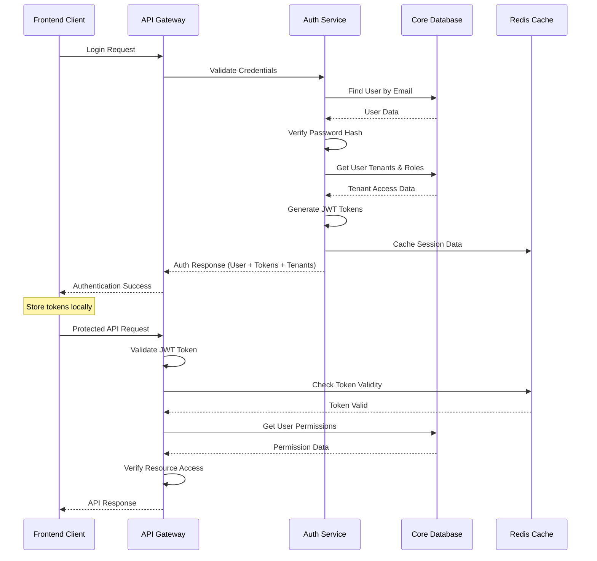
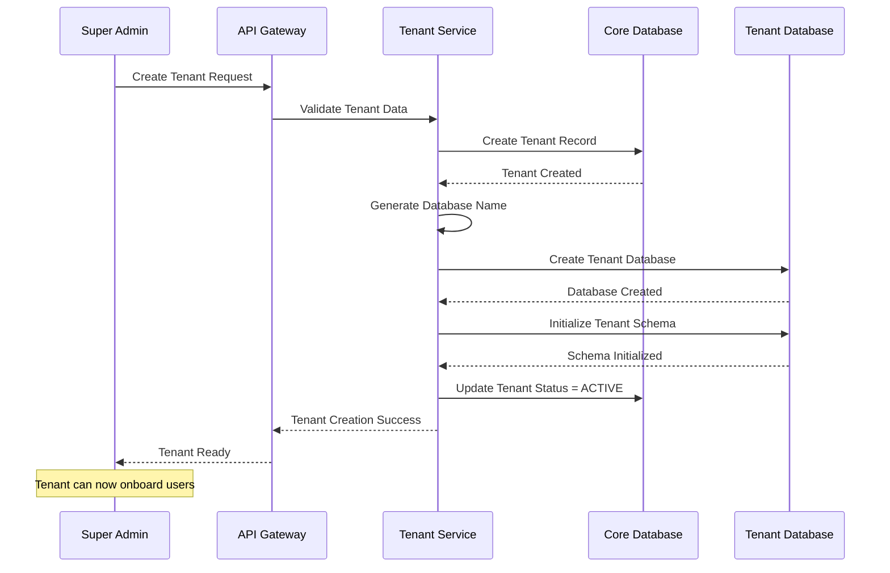
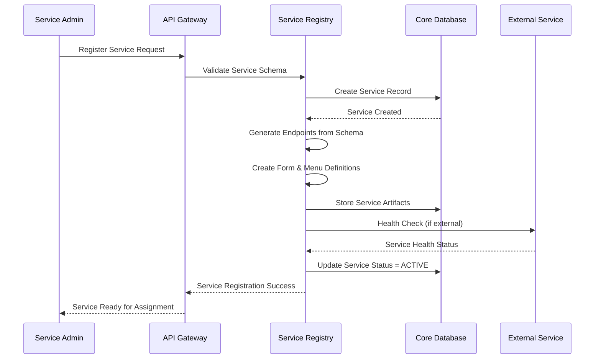
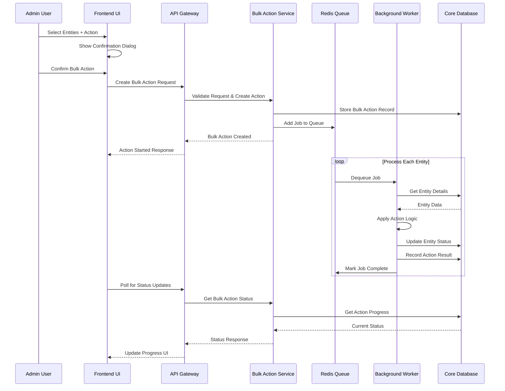
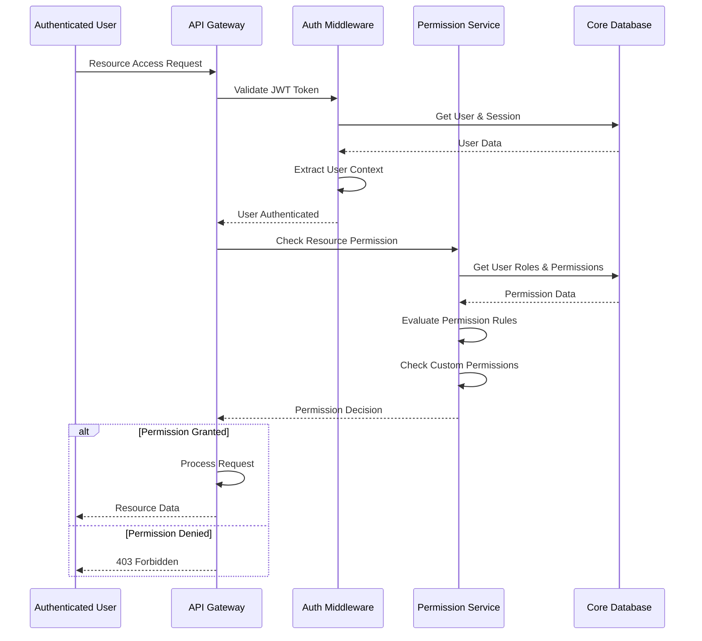
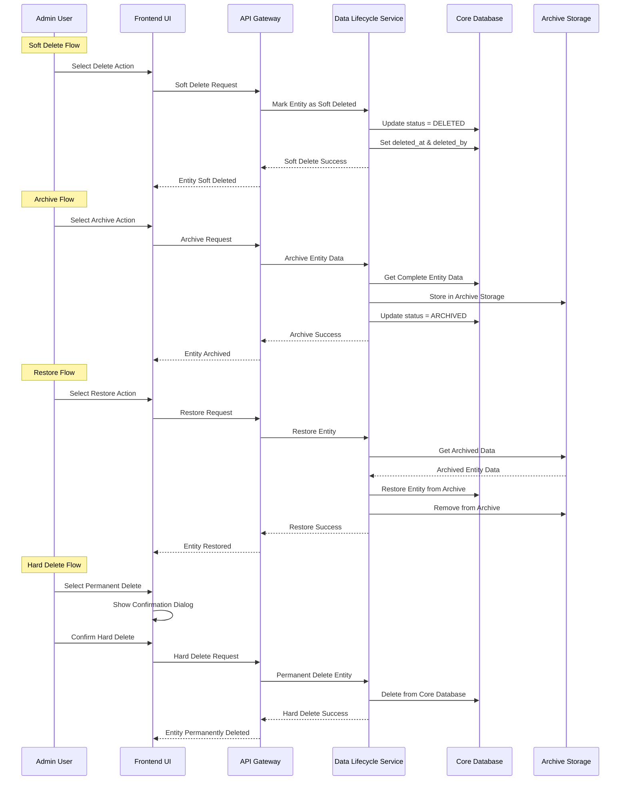

# Complete Database Schema - Multi-Tenant Service Management Platform

## Database Architecture Overview

Platform ini menggunakan **Hybrid Multi-Tenant Database Strategy** dengan kombinasi shared database untuk core metadata dan isolated databases untuk tenant-specific data.

## Database Strategy

### 1. **Shared Core Database** (`platform_core`)
- Centralized system data
- User management across all tenants
- Service registry dan metadata
- System configuration

### 2. **Tenant-Specific Databases** (`tenant_{tenant_id}`)
- Isolated data per tenant
- Custom schemas based on assigned services
- Independent backups dan restores
- Performance isolation

### 3. **Read Replicas**
- Core database replicas for reporting
- Tenant database replicas for analytics
- Reduced load on primary databases

### 4. **Database Engine Support**
- **Primary**: MySQL 8.0+ (Production Ready)
- **Future Support**: PostgreSQL, MongoDB (Scalability Options)

## Technology Stack

### Backend
- **Runtime**: Node.js 18+ LTS
- **ORM**: Prisma
- **Database**: MySQL 8.0+
- **Cache**: Redis 7.0+
- **Queue**: Bull Queue (Redis-based)

### Frontend
- **Framework**: Next.js 16+ dengan App Router
- **Language**: TypeScript 5.0+
- **State Management**: Zustand
- **Data Fetching**: TanStack Query

---

## Core Database Schema (`platform_core`)

### Prisma Schema Configuration

```prisma
// This is your Prisma schema file,
// learn more about it in the docs: https://pris.ly/d/prisma-schema

generator client {
  provider = "prisma-client-js"
}

datasource db {
  provider = "mysql"
  url      = env("DATABASE_URL")
}

// Universal Enums
enum EntityStatus {
  DRAFT
  ACTIVE
  INACTIVE
  SUSPENDED
  PENDING
  REJECTED
  ARCHIVED
  DELETED
}

enum DeletionStatus {
  SOFT_DELETED
  HARD_DELETED
  ARCHIVED
}

enum TenantType {
  CORE
  BUSINESS
  TRIAL
}

enum SubscriptionTier {
  STARTER
  PROFESSIONAL
  ENTERPRISE
  CUSTOM
}

enum ServiceType {
  INTERNAL
  EXTERNAL
  THIRD_PARTY
}

enum ServiceVisibility {
  PUBLIC
  PRIVATE
  RESTRICTED
}

enum AuthType {
  NONE
  API_KEY
  JWT
  OAUTH
  BASIC
}

enum HttpMethod {
  GET
  POST
  PUT
  DELETE
  PATCH
}

enum RoleType {
  SYSTEM
  TENANT
  CUSTOM
}

enum RoleLevel {
  SUPER_ADMIN
  ADMIN
  MANAGER
  USER
  GUEST
}

enum PermissionScope {
  OWN
  TENANT
  ALL
}

enum BulkActionStatus {
  PENDING
  IN_PROGRESS
  COMPLETED
  FAILED
  CANCELLED
}

enum ActionResult {
  SUCCESS
  FAILED
  SKIPPED
}

enum ImpactLevel {
  LOW
  MEDIUM
  HIGH
  CRITICAL
}

enum ConditionOperator {
  EQUALS
  NOT_EQUALS
  IN
  NOT_IN
  GREATER_THAN
  LESS_THAN
  BETWEEN
  CONTAINS
  STARTS_WITH
  ENDS_WITH
}
```

### 1. Users Table

```prisma
model User {
  id                String          @id @default(uuid())
  email             String          @unique
  passwordHash      String          @map("password_hash")
  name              String

  // Status Management
  status            EntityStatus    @default(PENDING)
  deletionStatus    DeletionStatus? @map("deletion_status")
  deletedAt         DateTime?       @map("deleted_at")
  deletedBy         String?         @map("deleted_by")
  archivedAt        DateTime?       @map("archived_at")
  archivedBy        String?         @map("archived_by")

  // Status Details
  suspensionReason  String?         @map("suspension_reason")
  suspensionUntil   DateTime?       @map("suspension_until")
  suspendedBy       String?         @map("suspended_by")
  rejectionReason   String?         @map("rejection_reason")
  rejectedBy        String?         @map("rejected_by")

  // Verification
  emailVerified     Boolean         @default(false) @map("email_verified")
  phoneVerified     Boolean         @default(false) @map("phone_verified")
  twoFactorEnabled  Boolean         @default(false) @map("two_factor_enabled")

  // Profile Information
  avatarUrl         String?         @map("avatar_url")
  timezone          String          @default("UTC")
  language          String          @default("en")
  phone             String?

  // Security
  lastLoginAt       DateTime?       @map("last_login_at")
  passwordChangedAt DateTime        @default(now()) @map("password_changed_at")
  failedLoginAttempts Int           @default(0) @map("failed_login_attempts")
  lockedUntil       DateTime?       @map("locked_until")
  tokenVersion      Int             @default(0) @map("token_version")

  // Preferences (JSON)
  preferences       Json?
  profileMetadata   Json?           @map("profile_metadata")

  // Audit Fields
  createdAt         DateTime        @default(now()) @map("created_at")
  updatedAt         DateTime        @updatedAt @map("updated_at")
  createdBy         String?         @map("created_by")
  updatedBy         String?         @map("updated_by")

  // Relations
  homeTenant        Tenant          @relation("HomeTenant", fields: [homeTenantId], references: [id])
  homeTenantId      String          @map("home_tenant_id")
  currentTenant     Tenant?         @relation("CurrentTenant", fields: [currentTenantId], references: [id])
  currentTenantId   String?         @map("current_tenant_id")

  createdTenants    Tenant[]        @relation("TenantCreator")
  updatedTenants    Tenant[]
  deletedTenants    Tenant[]
  archivedTenants   Tenant[]
  suspendedTenants  Tenant[]
  rejectedTenants   Tenant[]

  createdServices   Service[]       @relation("ServiceCreator")
  assignedServices  TenantService[]
  userTenants       UserTenant[]
  customPermissions UserCustomPermission[]
  bulkActions       BulkAction[]
  auditLogs         AuditLog[]
  sessions          Session[]
  archivedData      ArchivedData[]  @relation("ArchivedBy")
  restoredData      ArchivedData[]  @relation("RestoredBy")

  @@map("users")
  @@index([email])
  @@index([status])
  @@index([deletionStatus])
  @@index([createdAt])
  @@index([lastLoginAt])
  @@index([suspensionUntil])
  @@index([deletedAt])
  @@index([archivedAt])
}
```

### 2. Tenants Table

```prisma
model Tenant {
  id                String          @id @default(uuid())
  name              String
  slug              String          @unique
  domain            String?         @unique

  // Tenant Classification
  type              TenantType      @default(BUSINESS)
  tier              SubscriptionTier @default(STARTER)
  status            EntityStatus    @default(PENDING)
  deletionStatus    DeletionStatus? @map("deletion_status")
  deletedAt         DateTime?       @map("deleted_at")
  deletedBy         String?         @map("deleted_by")
  archivedAt        DateTime?       @map("archived_at")
  archivedBy        String?         @map("archived_by")

  // Status Details
  suspensionReason  String?         @map("suspension_reason")
  suspensionUntil   DateTime?       @map("suspension_until")
  suspendedBy       String?         @map("suspended_by")

  // Subscription & Limits
  subscriptionId    String?         @map("subscription_id")
  maxUsers          Int             @default(10)
  maxServices       Int             @default(5)
  storageLimitMb    Int             @default(1024) @map("storage_limit_mb")

  // Database Configuration
  databaseName      String          @unique @map("database_name")
  databaseHost      String?         @map("database_host")
  databasePort      Int             @default(3306) @map("database_port")

  // Branding & Customization
  primaryColor      String          @default("#3B82F6") @map("primary_color")
  logoUrl           String?         @map("logo_url")
  faviconUrl        String?         @map("favicon_url")
  customDomain      String?         @map("custom_domain")

  // Settings (JSON)
  settings          Json?
  featureFlags      Json?           @map("feature_flags")
  integrations      Json?

  // Audit Fields
  createdAt         DateTime        @default(now()) @map("created_at")
  updatedAt         DateTime        @updatedAt @map("updated_at")
  createdBy         String?         @map("created_by")
  updatedBy         String?         @map("updated_by")

  // Relations
  creator           User?           @relation("TenantCreator", fields: [createdBy], references: [id])
  updater           User?           @relation("TenantUpdater", fields: [updatedBy], references: [id])
  deleter           User?           @relation("TenantDeleter", fields: [deletedBy], references: [id])
  archiver          User?           @relation("TenantArchiver", fields: [archivedBy], references: [id])
  suspender         User?           @relation("TenantSuspender", fields: [suspendedBy], references: [id])
  rejecter          User?           @relation("TenantRejecter", fields: [rejectedBy], references: [id])

  homeUsers         User[]          @relation("HomeTenant")
  currentUsers      User[]          @relation("CurrentTenant")
  userTenants       UserTenant[]
  roles             Role[]
  services          Service[]
  tenantServices    TenantService[]
  auditLogs         AuditLog[]
  archivedData      ArchivedData[]

  @@map("tenants")
  @@unique([name, type])
  @@index([slug])
  @@index([type])
  @@index([status])
  @@index([tier])
  @@index([domain])
  @@index([deletedAt])
}
```

### 3. Permissions Table (NEW - Normalized)

```prisma
model Permission {
  id                   String         @id @default(uuid())
  name                 String         @unique
  resource             String
  action               String
  scope                PermissionScope @default(TENANT)
  description          String?
  category             String?
  isSystemPermission   Boolean        @default(false) @map("is_system_permission")

  createdAt            DateTime       @default(now()) @map("created_at")
  updatedAt            DateTime       @updatedAt @map("updated_at")

  // Relations
  rolePermissions      RolePermission[]
  endpointPermissions  EndpointPermission[]
  userCustomPermissions UserCustomPermission[]
  configAccessPermissions ConfigAccessPermission[]
  permissionConditions PermissionCondition[]

  @@map("permissions")
  @@unique([resource, action, scope])
  @@index([resource])
  @@index([action])
  @@index([scope])
  @@index([category])
}

model PermissionCondition {
  id                String          @id @default(uuid())
  permissionId      String          @map("permission_id")
  conditionType     String          @map("condition_type")
  conditionKey      String          @map("condition_key")
  conditionOperator ConditionOperator @map("condition_operator")
  conditionValue    String?         @map("condition_value")
  description       String?

  createdAt         DateTime        @default(now()) @map("created_at")

  // Relations
  permission        Permission      @relation(fields: [permissionId], references: [id], onDelete: Cascade)

  @@map("permission_conditions")
  @@index([permissionId])
  @@index([conditionType])
}
```

### 4. Roles Table (FIXED - No JSON)

```prisma
model Role {
  id                String          @id @default(uuid())
  name              String
  displayName       String          @map("display_name")
  description       String?
  type              RoleType        @default(TENANT)
  level             RoleLevel       @default(USER)
  tenantId          String?         @map("tenant_id")
  isSystemRole      Boolean         @default(false) @map("is_system_role")
  isDefaultRole     Boolean         @default(false) @map("is_default_role")
  maxUsers          Int?            @map("max_users")
  parentRoleId      String?         @map("parent_role_id")

  createdAt         DateTime        @default(now()) @map("created_at")
  updatedAt         DateTime        @updatedAt @map("updated_at")

  // Relations
  tenant            Tenant?         @relation(fields: [tenantId], references: [id], onDelete: Cascade)
  parentRole        Role?           @relation("RoleHierarchy", fields: [parentRoleId], references: [id])
  childRoles        Role[]          @relation("RoleHierarchy")
  rolePermissions   RolePermission[]
  userTenants       UserTenant[]
  configAccessPermissions ConfigAccessPermission[]
  endpointPermissions EndpointPermission[]

  @@map("roles")
  @@unique([name, tenantId])
  @@index([type])
  @@index([level])
  @@index([tenantId])
}

model RolePermission {
  id         String   @id @default(uuid())
  roleId     String   @map("role_id")
  permissionId String @map("permission_id")
  grantedAt  DateTime @default(now()) @map("granted_at")
  grantedBy  String?  @map("granted_by")

  // Relations
  role       Role     @relation(fields: [roleId], references: [id], onDelete: Cascade)
  permission Permission @relation(fields: [permissionId], references: [id], onDelete: Cascade)
  granter    User?    @relation("RolePermissionGranter", fields: [grantedBy], references: [id])

  @@map("role_permissions")
  @@unique([roleId, permissionId])
  @@index([roleId])
  @@index([permissionId])
}
```

### 5. User Tenants Table (FIXED - No JSON)

```prisma
model UserTenant {
  id                String       @id @default(uuid())
  userId            String       @map("user_id")
  tenantId          String       @map("tenant_id")
  roleId            String       @map("role_id")
  status            EntityStatus @default(PENDING)
  isPrimary         Boolean      @default(false) @map("is_primary")
  assignedBy        String?      @map("assigned_by")
  assignedAt        DateTime     @default(now()) @map("assigned_at")
  expiresAt         DateTime?    @map("expires_at")

  // Status Details
  suspensionReason  String?      @map("suspension_reason")
  suspensionUntil   DateTime?    @map("suspension_until")
  suspendedBy       String?      @map("suspended_by")

  // Preferences (JSON - Valid Usage)
  tenantPreferences Json?        @map("tenant_preferences")

  // Access History
  lastAccessedAt    DateTime?    @map("last_accessed_at")
  accessCount       Int          @default(0) @map("access_count")

  createdAt         DateTime     @default(now()) @map("created_at")
  updatedAt         DateTime     @updatedAt @map("updated_at")

  // Relations
  user              User         @relation(fields: [userId], references: [id], onDelete: Cascade)
  tenant            Tenant       @relation(fields: [tenantId], references: [id], onDelete: Cascade)
  role              Role         @relation(fields: [roleId], references: [id])
  assigner          User?        @relation("UserTenantAssigner", fields: [assignedBy], references: [id])
  suspender         User?        @relation("UserTenantSuspender", fields: [suspendedBy], references: [id])
  customPermissions UserCustomPermission[]

  @@map("user_tenants")
  @@unique([userId, tenantId])
  @@index([userId])
  @@index([tenantId])
  @@index([roleId])
  @@index([status])
}

model UserCustomPermission {
  id            String   @id @default(uuid())
  userTenantId  String   @map("user_tenant_id")
  permissionId  String   @map("permission_id")
  grantedBy     String?  @map("granted_by")
  grantedAt     DateTime @default(now()) @map("granted_at")
  expiresAt     DateTime? @map("expires_at")
  isGranted     Boolean  @default(true) @map("is_granted")
  reason        String?

  // Relations
  userTenant    UserTenant @relation(fields: [userTenantId], references: [id], onDelete: Cascade)
  permission    Permission @relation(fields: [permissionId], references: [id], onDelete: Cascade)
  granter       User?      @relation("UserCustomPermissionGranter", fields: [grantedBy], references: [id])

  @@map("user_custom_permissions")
  @@unique([userTenantId, permissionId])
  @@index([userTenantId])
  @@index([permissionId])
}
```

### 6. Services Registry Table

```prisma
model Service {
  id                  String          @id @default(uuid())
  name                String
  displayName         String          @map("display_name")
  description         String?
  version             String          @default("1.0.0")

  // Service Classification
  type                ServiceType     @default(INTERNAL)
  category            String?
  tags                Json?           // Array of tags (Valid Usage)

  // Status & Availability
  status              EntityStatus    @default(PENDING)
  visibility          ServiceVisibility @default(PRIVATE)
  deletionStatus      DeletionStatus? @map("deletion_status")
  deletedAt           DateTime?       @map("deleted_at")
  deletedBy           String?         @map("deleted_by")

  // Service Configuration
  baseUrl             String?         @map("base_url")
  apiVersion          String          @default("v1") @map("api_version")
  healthCheckUrl      String?         @map("health_check_url")
  healthCheckInterval Int             @default(300) @map("health_check_interval")

  // Authentication
  authType            AuthType        @default(NONE) @map("auth_type")
  authConfig          Json?           @map("auth_config")

  // Integration Settings
  webhookUrl          String?         @map("webhook_url")
  webhookSecret       String?         @map("webhook_secret")
  rateLimit           Int             @default(1000) @map("rate_limit")
  timeoutMs           Int             @default(30000) @map("timeout_ms")

  // Form & Menu Configuration (Valid Usage)
  formSchema          Json?           @map("form_schema")
  menuSchema          Json?           @map("menu_schema")
  uiComponents        Json?           @map("ui_components")

  // Service Metadata
  documentationUrl    String?         @map("documentation_url")
  supportEmail        String?         @map("support_email")
  contactInfo         Json?           @map("contact_info")

  // Registration Info
  registeredBy        String          @map("registered_by")
  tenantId            String?         @map("tenant_id")
  isCoreService       Boolean         @default(false) @map("is_core_service")

  // Audit Fields
  createdAt           DateTime        @default(now()) @map("created_at")
  updatedAt           DateTime        @updatedAt @map("updated_at")

  // Relations
  registrar           User            @relation("ServiceCreator", fields: [registeredBy], references: [id])
  deleter             User?           @relation("ServiceDeleter", fields: [deletedBy], references: [id])
  owner               Tenant?         @relation(fields: [tenantId], references: [id])
  endpoints           ServiceEndpoint[]
  tenantServices      TenantService[]
  endpointPermissions EndpointPermission[]

  @@map("services")
  @@unique([name, type])
  @@index([name])
  @@index([type])
  @@index([status])
  @@index([category])
  @@index([visibility])
  @@index([tenantId])
  @@index([deletedAt])
}
```

### 7. Service Endpoints Table (FIXED - No JSON)

```prisma
model ServiceEndpoint {
  id                  String       @id @default(uuid())
  serviceId           String       @map("service_id")
  name                String
  displayName         String       @map("display_name")
  description         String?

  // Endpoint Configuration
  method              HttpMethod
  path                String
  urlTemplate         String?      @map("url_template")

  // Request/Response Configuration (Valid Usage)
  requestSchema       Json?        @map("request_schema")
  responseSchema      Json?        @map("response_schema")
  pathParams          Json?        @map("path_params")
  queryParams        Json?        @map("query_params")

  // Form Configuration (Valid Usage)
  formConfig          Json?        @map("form_config")
  validationRules     Json?        @map("validation_rules")

  // Access Control
  requiresAuth        Boolean      @default(true) @map("requires_auth")
  rateLimitOverride   Int?         @map("rate_limit_override")
  timeoutOverride     Int?         @map("timeout_override")

  // Endpoint Features
  isWebhook           Boolean      @default(false) @map("is_webhook")
  isBatch             Boolean      @default(false) @map("is_batch")
  supportsPagination  Boolean      @default(false) @map("supports_pagination")
  cacheDuration       Int          @default(0) @map("cache_duration")

  // Status & Configuration
  status              EntityStatus @default(ACTIVE)
  sortOrder           Int          @default(0) @map("sort_order")

  // Audit Fields
  createdAt           DateTime     @default(now()) @map("created_at")
  updatedAt           DateTime     @updatedAt @map("updated_at")

  // Relations
  service             Service      @relation(fields: [serviceId], references: [id], onDelete: Cascade)
  endpointPermissions EndpointPermission[]

  @@map("service_endpoints")
  @@unique([serviceId, method, path])
  @@index([serviceId])
  @@index([method])
  @@index([status])
}

model EndpointPermission {
  id           String   @id @default(uuid())
  endpointId   String   @map("endpoint_id")
  permissionId String   @map("permission_id")
  isRequired   Boolean  @default(true) @map("is_required")
  createdAt    DateTime @default(now()) @map("created_at")

  // Relations
  endpoint     ServiceEndpoint @relation(fields: [endpointId], references: [id], onDelete: Cascade)
  permission   Permission @relation(fields: [permissionId], references: [id], onDelete: Cascade)

  @@map("endpoint_permissions")
  @@unique([endpointId, permissionId])
  @@index([endpointId])
  @@index([permissionId])
}
```

### 8. Tenant Services Table

```prisma
model TenantService {
  id              String       @id @default(uuid())
  tenantId        String       @map("tenant_id")
  serviceId       String       @map("service_id")
  status          EntityStatus @default(ACTIVE)

  // Assignment Configuration (Valid Usage)
  customSettings  Json?        @map("custom_settings")
  customMenuConfig Json?       @map("custom_menu_config")

  // Access Control
  assignedBy      String       @map("assigned_by")
  assignedAt      DateTime     @default(now()) @map("assigned_at")

  // Usage Limits
  monthlyQuota    Int?         @map("monthly_quota")
  dailyQuota      Int?         @map("daily_quota")
  hourlyQuota     Int?         @map("hourly_quota")

  // Usage Tracking
  usageCount      Int          @default(0) @map("usage_count")
  lastUsedAt      DateTime?    @map("last_used_at")

  // Audit Fields
  createdAt       DateTime     @default(now()) @map("created_at")
  updatedAt       DateTime     @updatedAt @map("updated_at")

  // Relations
  tenant          Tenant       @relation(fields: [tenantId], references: [id], onDelete: Cascade)
  service         Service      @relation(fields: [serviceId], references: [id], onDelete: Cascade)
  assigner        User         @relation("TenantServiceAssigner", fields: [assignedBy], references: [id])

  @@map("tenant_services")
  @@unique([tenantId, serviceId])
  @@index([tenantId])
  @@index([serviceId])
  @@index([status])
}
```

### 9. System Configurations Table (FIXED - No JSON)

```prisma
model SystemConfig {
  id                String   @id @default(uuid())
  key               String   @unique
  value             Json     // ✅ OK: Configuration values can be complex JSON
  description       String?
  type              String   @default("SYSTEM") // SYSTEM, TENANT, SERVICE, USER
  scope             String?
  isEncrypted       Boolean  @default(false) @map("is_encrypted")
  isPublic          Boolean  @default(false) @map("is_public")
  validationSchema  Json?    @map("validation_schema") // ✅ OK: Validation schema needs JSON
  defaultValue      Json?    @map("default_value") // ✅ OK: Default values can be JSON

  createdAt         DateTime @default(now()) @map("created_at")
  updatedAt         DateTime @updatedAt @map("updated_at")
  createdBy         String?  @map("created_by")
  updatedBy         String?  @map("updated_by")

  // Relations
  creator           User?    @relation("SystemConfigCreator", fields: [createdBy], references: [id])
  updater           User?    @relation("SystemConfigUpdater", fields: [updatedBy], references: [id])
  accessPermissions ConfigAccessPermission[]

  @@map("system_configs")
  @@index([key])
  @@index([type])
  @@index([scope])
}

model ConfigAccessPermission {
  id             String           @id @default(uuid())
  configId       String           @map("config_id")
  roleId         String           @map("role_id")
  permissionType String           @map("permission_type") // READ, WRITE, DELETE
  grantedBy      String           @map("granted_by")
  grantedAt      DateTime         @default(now()) @map("granted_at")

  // Relations
  config         SystemConfig     @relation(fields: [configId], references: [id], onDelete: Cascade)
  role           Role             @relation(fields: [roleId], references: [id], onDelete: Cascade)
  granter        User?            @relation("ConfigAccessGranter", fields: [grantedBy], references: [id])

  @@map("config_access_permissions")
  @@unique([configId, roleId, permissionType])
  @@index([configId])
  @@index([roleId])
}
```

### 10. Bulk Actions Table (NEW)

```prisma
model BulkAction {
  id                String           @id @default(uuid())
  actionType        String           @map("action_type") // activate, deactivate, suspend, delete, archive, restore
  entityType        String           @map("entity_type") // users, tenants, services, roles
  status            BulkActionStatus @default(PENDING)

  // Action Details
  totalEntities     Int              @default(0) @map("total_entities")
  processedEntities Int              @default(0) @map("processed_entities")
  successfulEntities Int             @default(0) @map("successful_entities")
  failedEntities    Int              @default(0) @map("failed_entities")

  // Action Parameters
  parameters        Json?            // Action-specific parameters
  filters           Json?            // Applied filters

  // Execution Details
  startedAt         DateTime?        @map("started_at")
  completedAt       DateTime?        @map("completed_at")
  errorMessage      String?          @map("error_message")

  // Audit
  createdBy         String           @map("created_by")
  createdAt         DateTime         @default(now()) @map("created_at")
  updatedAt         DateTime         @updatedAt @map("updated_at")

  // Relations
  creator           User             @relation("BulkActionCreator", fields: [createdBy], references: [id])
  results           BulkActionResult[]

  @@map("bulk_actions")
  @@index([actionType])
  @@index([entityType])
  @@index([status])
  @@index([createdBy])
  @@index([createdAt])
}

model BulkActionResult {
  id           String       @id @default(uuid())
  bulkActionId String       @map("bulk_action_id")
  entityId     String       @map("entity_id")
  entityType   String       @map("entity_type")

  // Result Status
  status       ActionResult @default(SUCCESS)
  message      String?
  oldValues    Json?        @map("old_values")
  newValues    Json?        @map("new_values")

  // Timing
  startedAt    DateTime?    @map("started_at")
  completedAt  DateTime?    @map("completed_at")

  // Relations
  bulkAction   BulkAction   @relation(fields: [bulkActionId], references: [id], onDelete: Cascade)

  @@map("bulk_action_results")
  @@index([bulkActionId])
  @@index([entityId, entityType])
  @@index([status])
}
```

### 11. Archive Tables (NEW)

```prisma
model ArchivedData {
  id           String    @id @default(uuid())
  entityType   String    @map("entity_type")
  entityId     String    @map("entity_id")
  data         Json      // Complete archived entity data
  archiveReason String?  @map("archive_reason")
  archivedBy   String    @map("archived_by")
  archivedAt   DateTime  @default(now()) @map("archived_at")
  restoredAt   DateTime? @map("restored_at")
  restoredBy   String?   @map("restored_by")

  // Relations
  archiver     User      @relation("ArchivedBy", fields: [archivedBy], references: [id])
  restorer     User?     @relation("RestoredBy", fields: [restoredBy], references: [id])

  @@map("archived_data")
  @@index([entityType, entityId])
  @@index([archivedBy])
  @@index([archivedAt])
}
```

### 12. Enhanced Audit Log Table

```prisma
model AuditLog {
  id                String       @id @default(uuid())
  userId            String?      @map("user_id")
  tenantId          String?      @map("tenant_id")
  action            String
  resource          String
  resourceId        String?      @map("resource_id")

  // Data Changes
  oldValues         Json?        @map("old_values")
  newValues         Json?        @map("new_values")
  changesSummary    Json?        @map("changes_summary")

  // Request Information
  ipAddress         String?      @map("ip_address")
  userAgent         String?      @map("user_agent")
  requestId         String?      @map("request_id")

  // Impact Assessment
  impactLevel       ImpactLevel @default(MEDIUM) @map("impact_level")
  affectedEntities  Json?        @map("affected_entities")
  bulkActionId      String?      @map("bulk_action_id")

  // Metadata
  metadata          Json?

  // Timestamp
  timestamp         DateTime     @default(now())

  // Relations
  user              User?        @relation(fields: [userId], references: [id])
  tenant            Tenant?      @relation(fields: [tenantId], references: [id])
  bulkAction        BulkAction?  @relation(fields: [bulkActionId], references: [id])

  @@map("audit_logs")
  @@index([userId])
  @@index([tenantId])
  @@index([action])
  @@index([resource])
  @@index([timestamp])
  @@index([impactLevel])
  @@index([bulkActionId])
}
```

### 13. Session Management

```prisma
model Session {
  id           String   @id @default(uuid())
  userId       String   @map("user_id")
  token        String   @unique
  refreshToken String?  @unique @map("refresh_token")
  deviceId     String   @map("device_id")
  userAgent    String?  @map("user_agent")
  ipAddress    String?  @map("ip_address")
  isActive     Boolean  @default(true) @map("is_active")
  expiresAt    DateTime @map("expires_at")
  lastAccessAt DateTime @default(now()) @map("last_accessed_at")
  createdAt    DateTime @default(now()) @map("created_at")

  // Relations
  user         User     @relation(fields: [userId], references: [id], onDelete: Cascade)

  @@map("sessions")
  @@index([userId])
  @@index([token])
  @@index([deviceId])
  @@index([expiresAt])
  @@index([isActive])
}
```

---

## Module Flow Diagrams

### 1. Authentication & Authorization Flow



### 2. Tenant Management Flow



### 3. Service Registration Flow



### 4. Bulk Action Processing Flow



### 5. Permission Checking Flow



### 6. Data Lifecycle Management Flow



---

## Summary of JSON Usage

### ✅ Valid JSON Usage (Kept):
1. **Users.preferences** - User preferences membutuhkan struktur fleksibel
2. **Users.profile_metadata** - Profile metadata bisa beragam
3. **Tenants.settings, feature_flags, integrations** - Configuration kompleks
4. **Services.form_schema, menu_schema, auth_config** - Dynamic schema definition
5. **Service Endpoints.request_schema, response_schema** - API schema definition
6. **Tenant Services.custom_settings, custom_menu_config** - Custom configuration
7. **System Configurations.value, validation_schema, default_value** - Configuration values
8. **Bulk Actions.parameters, filters** - Dynamic action parameters
9. **Audit Logs.old_values, new_values, metadata** - Audit data
10. **ArchivedData.data** - Complete archived entity data

### ❌ Invalid JSON Usage (Removed and Normalized):
1. **Roles.permissions** → `role_permissions` table
2. **Service Endpoints.required_permissions** → `endpoint_permissions` table
3. **User Tenants.custom_permissions** → `user_custom_permissions` table
4. **System Configurations.access_permissions** → `config_access_permissions` table

---

## Implementation Tasks

### Phase 1: Database Setup (Week 1)
1. **Setup MySQL 8.0+**
   - Install MySQL server
   - Create `platform_core` database
   - Configure MySQL for multi-tenant support

2. **Setup Node.js Project**
   ```bash
   npm init -y
   npm install prisma @prisma/client
   npm install -D @types/node
   ```

3. **Initialize Prisma**
   ```bash
   npx prisma init
   # Copy schema above to prisma/schema.prisma
   ```

4. **Generate Prisma Client**
   ```bash
   npx prisma generate
   ```

5. **Run Database Migrations**
   ```bash
   npx prisma migrate dev --name init
   ```

### Phase 2: Core Services (Week 2-3)
1. **Authentication Service**
   - User registration & login
   - JWT token management
   - Multi-tenant session handling

2. **Tenant Management Service**
   - Tenant creation & provisioning
   - Database per tenant setup
   - User-tenant relationships

3. **Permission Service**
   - Role-based access control
   - Dynamic permission checking
   - Custom permission support

### Phase 3: Service Registry (Week 4)
1. **Service Registration**
   - Internal service registration
   - External service integration
   - Health monitoring

2. **Dynamic Form Builder**
   - Schema-based form generation
   - Form validation
   - Service integration

### Phase 4: Bulk Actions (Week 5)
1. **Bulk Action Framework**
   - Queue-based processing
   - Progress tracking
   - Error handling

2. **Data Lifecycle Management**
   - Soft delete & restore
   - Archive & restore
   - Hard delete with confirmation

### Phase 5: Frontend Integration (Week 6-7)
1. **Authentication UI**
   - Login forms
   - Tenant switching
   - Session management

2. **Admin Dashboard**
   - Bulk actions interface
   - User & tenant management
   - Service management

### Phase 6: Testing & Deployment (Week 8)
1. **Testing Suite**
   - Unit tests
   - Integration tests
   - E2E tests

2. **Production Deployment**
   - Environment setup
   - Database migrations
   - Monitoring & logging

---

**Document Version**: 1.0
**Last Updated**: 30 Oktober 2025
**Status**: Ready for Implementation